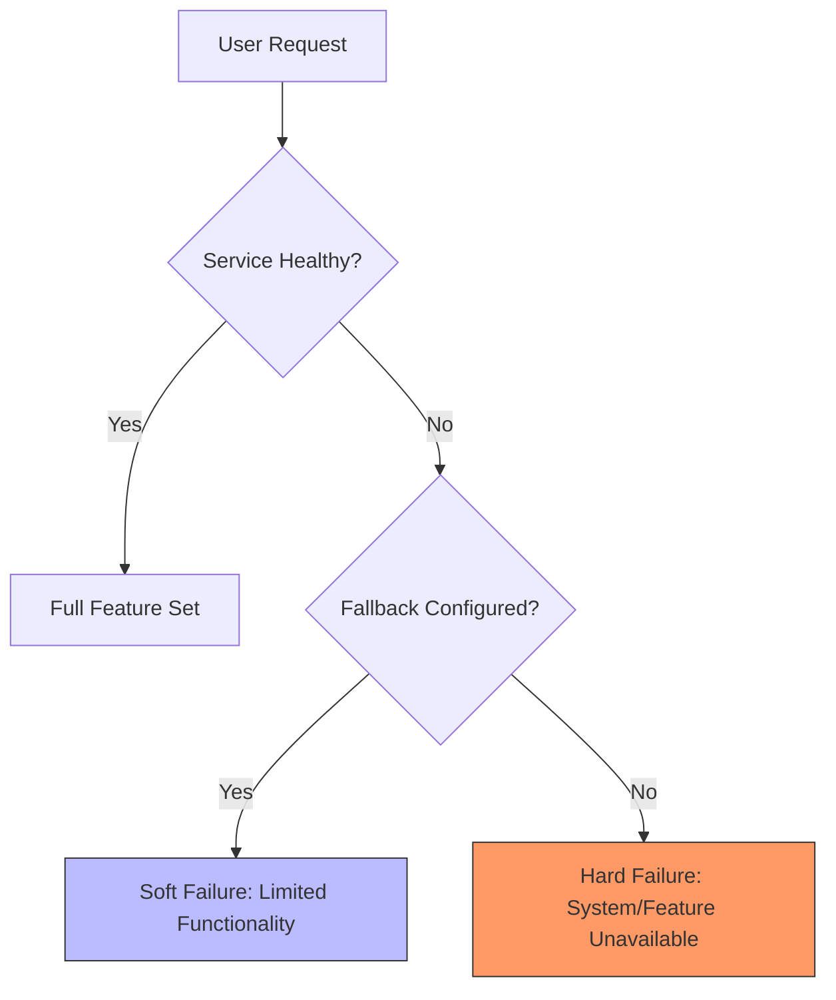

# Graceful degradation

Graceful degradation is a system's ability to maintain essential functionality when specific components fail or experience resource exhaustion. For technical writers, documenting fallback behaviors, feature dependency tiers, and load-shedding procedures helps engineers manage partial outages and ensures users understand temporary platform limitations.

---

## Hard failure vs. soft failure

When a system component fails, a poorly designed architecture may suffer a **hard failure** (or cascading failure). In this scenario, the failure of a single non-critical dependency causes the entire system to become unavailable. For example, if a recommendation microservice on an ecommerce site crashes and the checkout page is tightly coupled to it, the user cannot complete their purchase.

By contrast, a system designed with graceful degradation experiences a **soft failure**. If the system detects that the recommendation service is unresponsive, it invokes a fallback mechanism—such as replacing the widget with a static "Popular Items" list or hiding the section entirely—allowing the core checkout workflow to continue.

Common examples of graceful degradation include:

- **Streaming services:** Using Adaptive Bitrate Streaming (ABR) to lower video resolution when bandwidth drops, rather than buffering or terminating the stream.
- **Search interfaces:** Falling back to a cached result set or a simplified "Top Results" index when the primary search cluster (e.g., [Elasticsearch](https://www.elastic.co/elasticsearch/)) is unavailable.
- **Mobile apps:** Implementing an "Offline-first" approach where data is written to a local database (like SQLite or Realm) and synchronized with the server once connectivity is restored.

---

## What to document for developers and operators

To support graceful degradation, work with engineering teams to document how the system behaves during partial failures:

- **Document feature dependency tiers:** Categorize platform features into tiers. 
    - **Tier 1 (Critical):** Features essential to business continuity, such as authentication, payment processing, or core data persistence. 
    - **Tier 2/3 (Non-essential):** Features that enhance the experience but are not required for the primary transaction, such as search autocomplete, "who's online" lists, or user avatars.
- **Document API fallbacks:** In API reference guides, define the expected response when downstream dependencies fail. Specify if an endpoint returns stale/cached data, a partial JSON object, or a default static response during a degradation event.
- **Create kill-switch playbooks:** Provide instructions on how to manually trigger load shedding. When a system is under heavy load, operators may need to disable resource-intensive Tier 3 features to preserve Tier 1 stability.

!!! info "Feature Flags and Kill Switches"
    Many systems use feature flags, such as [LaunchDarkly](https://launchdarkly.com/), as "kill switches." In operations playbooks, document the exact flag keys and the expected impact of toggling them. Toggling these flags **reduces system load** by disabling non-essential functionality to protect the health of core services.

---

## Designing UI and user-facing copy for partial outages

When a system degrades, the UI must communicate the state of the system to prevent user frustration:

- **Avoid raw technical errors:** Do not expose low-level errors like "500 Internal Server Error" or "Upstream timeout." Use banners that explain the functional impact: "Search is temporarily unavailable, but you can still browse categories and checkout."
- **Disable rather than hide UI elements:** If a feature is temporarily disabled by a kill switch, gray out the UI element and provide a tooltip. Hiding elements can lead users to believe their account permissions have changed or the UI is buggy.

---

## Why documenting graceful degradation matters

- **Protects business revenue:** Ensures that "money-making" paths (like checkout) remain open even when secondary services fail.
- **Reduces support ticket volume:** Proactive UI communication prevents users from reporting known outages.
- **Simplifies incident response:** Clear documentation of dependencies and kill switches allows Site Reliability Engineers (SREs) to stabilize the system quickly without resorting to high-risk operations like database restarts.