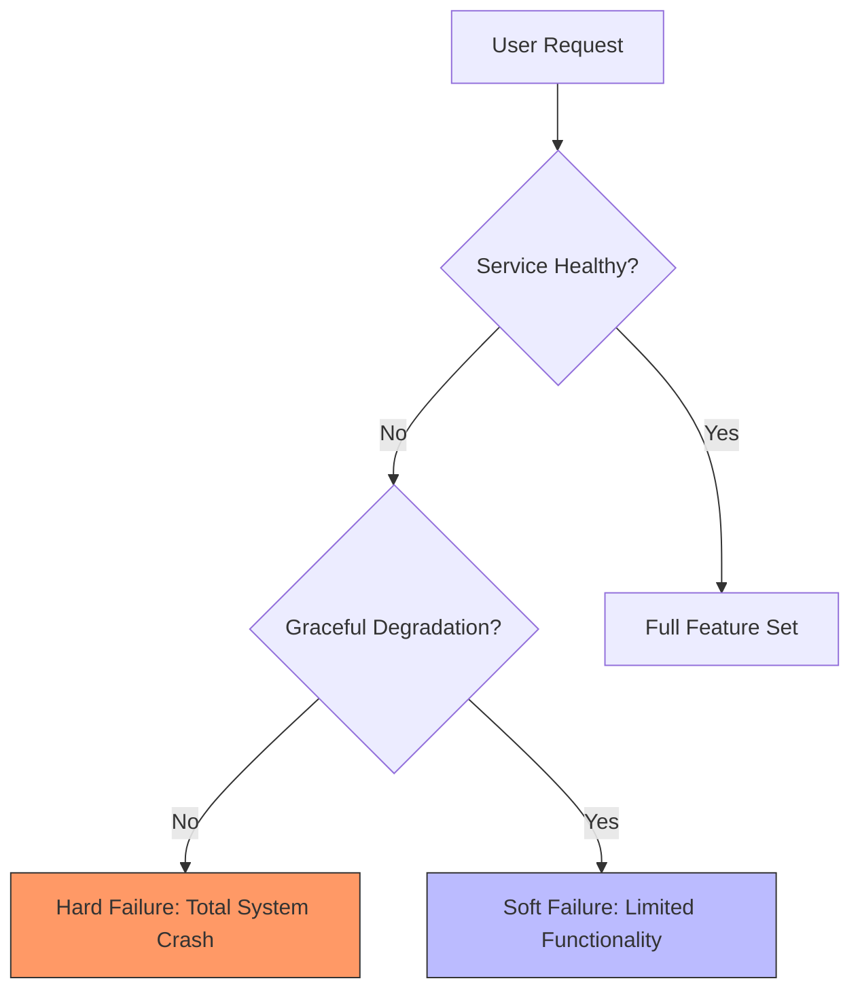

# Graceful degradation

Graceful degradation is a system's ability to maintain essential functionality when parts of its infrastructure fail or experience high load. For technical writers, documenting fallback behaviors, feature dependency tiers, and load-shedding procedures helps engineers manage partial outages and helps users understand temporary platform limits.

---

## Hard failure vs. soft failure

When a system component fails, a poorly designed architecture might suffer a total collapse, known as a hard failure. For example, if a recommendation microservice on an ecommerce site crashes, a hard failure prevents the entire checkout page from loading. 

By contrast, a system designed with graceful degradation experiences a soft failure. If the ecommerce site detects that the recommendation service is offline, it replaces the recommendation widget with a static placeholder, letting the customer complete their purchase.

Common examples of graceful degradation include:

- **Streaming services:** Lowering video resolution from 4K to 1080p when bandwidth drops, instead of stopping playback.
- **Search interfaces:** Falling back to basic database matching when an advanced search cluster, such as [Elasticsearch](https://www.elastic.co/elasticsearch/){: target="_blank" rel="noopener" }, fails.
- **Mobile apps:** Storing user data locally when a device loses its internet connection, then syncing with the cloud once the connection is restored.

---

## What to document for developers and operators

To support graceful degradation, work with engineering teams to document how the system behaves during partial failures:

- **Document feature dependency tiers:** Categorize platform features into tiers. Tier 1 features are critical to business operations, such as authentication or payment processing. Tier 2 and Tier 3 features are non-essential, such as search autocomplete, recommendation widgets, or user avatars. Document which services belong to each tier.
- **Document API fallbacks:** In API reference guides, explain how endpoints respond when downstream dependencies fail. If a profile API returns cached data or static fallback objects during a degradation event, document this behavior so client apps can handle the response without crashing.
- **Create clear kill-switch playbooks:** When a system is under heavy load, operators need step-by-step instructions on how to manually trigger graceful degradation to save resources.

!!! info "Feature Flags and Kill Switches"
    Many modern systems use feature flags, such as [LaunchDarkly](https://launchdarkly.com/){: target="_blank" rel="noopener" }, as kill switches to turn off resource-heavy features. In operations playbooks, document the exact feature flag names, where to manage them, and how to toggle them to degrade system performance during high-traffic events.

---

## Designing UI and user-facing copy for partial outages

When a system degrades, user interface (UI) copy helps manage customer expectations. Help your product team design clear system notices:

- **Avoid raw technical errors:** Do not show users developer-focused error messages, such as "500 Internal Server Error" or "Connection timed out." Use friendly, informative banners that explain the limitation. For example: "We're experiencing high traffic. Our search feature is temporarily disabled, but you can still browse items and complete your purchase."
- **Disable rather than hide UI elements:** If a feature is temporarily off, gray out the UI button and add a tooltip explaining its status. Hiding the element might make users think the interface is broken or their accounts are corrupted.

---

## Why documenting graceful degradation matters

- **Protects business revenue:** Keeping core workflows like checkout or login operational during high-load events prevents total business disruption.
- **Reduces support ticket volume:** Clear copy explaining partial outages prevents users from submitting duplicate support requests for known temporary issues.
- **Simplifies incident response:** Documented playbooks for feature degradation give SREs and operators quick, safe ways to stabilize a system without performing risky database restarts.