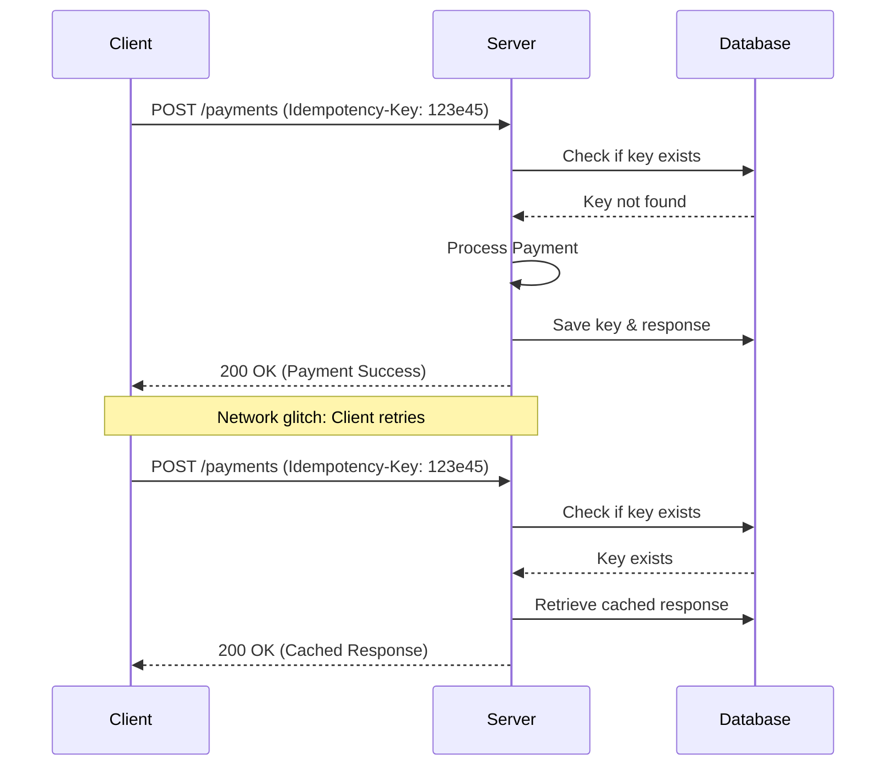

# Idempotency

Idempotency is a property of an API endpoint or software operation where executing it multiple times produces the same system state as a single execution. When you document idempotency, you help developers design reliable retry mechanisms that prevent duplicate transactions, double payments, or corrupted data.

---

## The retry problem

In a distributed system, network failures occur. If a client application sends an API request to charge a credit card, but the network connection drops before the client receives the response, the client cannot determine if the payment succeeded. 

If the client retries the request without idempotency protection, the server might charge the customer twice. If the endpoint is idempotent, the client can safely retry the request. The server processes the payment once and returns the original response for all subsequent retries.

---

## HTTP methods and idempotency

When you document [REST](https://en.wikipedia.org/wiki/Representational_state_transfer){: target="_blank" rel="noopener" } APIs, specify which [HTTP](https://developer.mozilla.org/en-US/docs/Web/HTTP){: target="_blank" rel="noopener" } methods are inherently idempotent:

- **GET and HEAD:** Safe and idempotent. Retrieving data doesn't modify the system state, regardless of how many times you run the query.
- **PUT:** Idempotent. Replacing a resource with a specific payload multiple times results in the same state as a single request.
- **DELETE:** Idempotent. Deleting a specific resource (such as `/users/42`) leaves the resource deleted. Although subsequent requests might return a different HTTP status code—such as `404 Not Found` instead of `200 OK` or `204 No Content`—the state of the database remains the same.
- **POST:** Not idempotent. Sending a POST request multiple times typically creates multiple distinct resources, such as three separate orders.

---

## Documenting idempotency keys

Because POST requests are not inherently idempotent, systems often use unique identifiers, called *idempotency keys*, to make these operations safe. 

If your API supports idempotency keys, your documentation must explain the following process:

1. **Key generation:** The client generates a unique [UUID](https://en.wikipedia.org/wiki/Universally_unique_identifier){: target="_blank" rel="noopener" } (for example, `123e4567-e89b-12d3-a456-426614174000`) and includes it in the request header, such as `Idempotency-Key: <UUID>`.
2. **First request:** The server receives the request, processes the operation, and saves both the idempotency key and the resulting API response.
3. **Subsequent requests:** If the client retries the request with the same key, the server identifies the duplicate, skips the processing logic, and returns the cached response.

!!! warning "Key expiration and scope"
    Explicitly state the lifetime of an idempotency key (such as 24 hours) and its scope. If a developer uses the same key across different API endpoints, explain whether the system rejects the request or treats the keys independently.

---

## Best practices for documenting retry logic

When you write integration guides for financial or transactional APIs, provide actionable instructions on how to implement idempotency:

- **Provide retry guidelines:** Advise developers to use exponential backoff with jitter when they retry failed requests. This prevents client applications from overwhelming your servers during an outage.
- **Document retryable error codes:** List specific HTTP status codes that developers should retry (such as `502 Bad Gateway`, `503 Service Unavailable`, or `504 Gateway Timeout`) and those they should not retry (such as `400 Bad Request` or `401 Unauthorized`).
- **Use clear code examples:** Include code snippets in popular languages such as Python, Node.js, or Go that demonstrate how to generate a key, add it to a header, and handle retries.