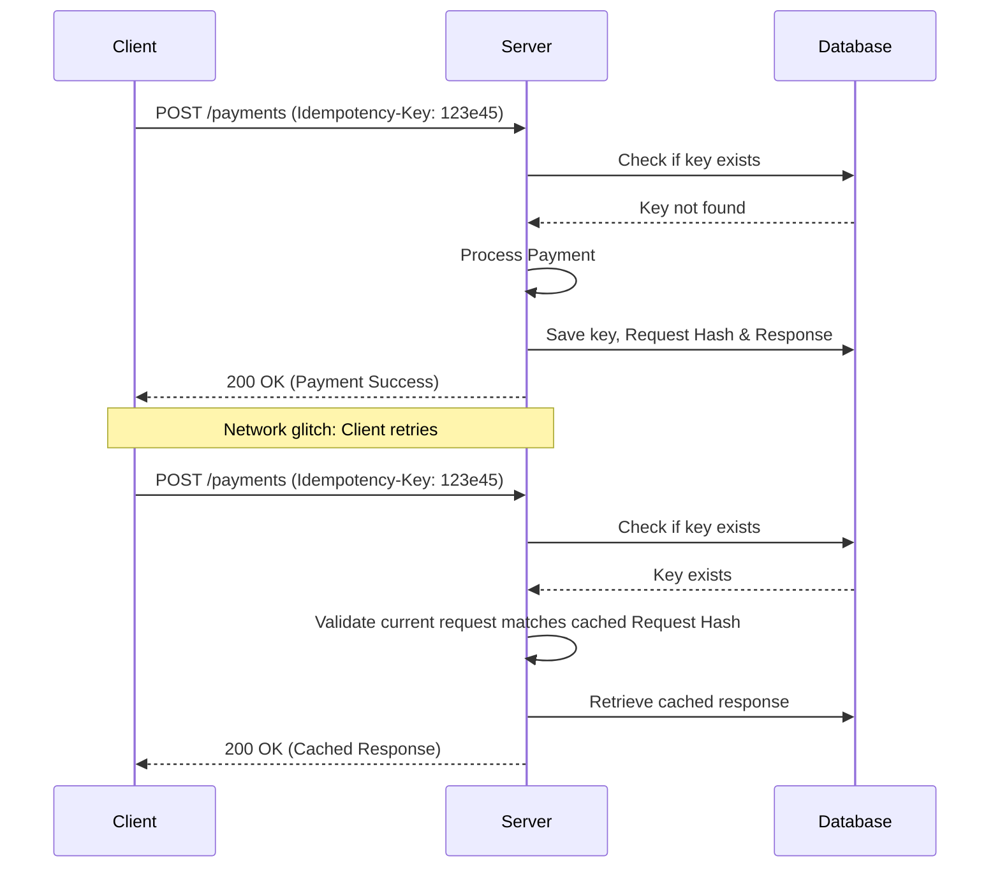

# Idempotency

Idempotency is a property of an API endpoint or software operation where executing it multiple times produces the same system state as a single execution. When you document idempotency, you help developers design reliable retry mechanisms that prevent duplicate transactions, double payments, or corrupted data.

---

## The retry problem

In a distributed system, network failures occur. If a client application sends an API request to charge a credit card, but the network connection drops before the client receives the response, the client cannot determine if the payment succeeded. 

If the client retries the request without idempotency protection, the server might charge the customer twice. If the endpoint is idempotent, the client can safely retry the request. The server processes the payment once and returns the original response for all subsequent retries.

---

## HTTP methods and idempotency

When you document [REST](https://en.wikipedia.org/wiki/Representational_state_transfer){: target="_blank" rel="noopener" } APIs, specify which [HTTP](https://developer.mozilla.org/en-US/docs/Web/HTTP){: target="_blank" rel="noopener" } methods are inherently idempotent:

- **GET, HEAD, OPTIONS, and TRACE:** Safe and idempotent. These methods are intended for retrieval and do not modify system state.
- **PUT:** Idempotent. Replacing a resource with a specific payload multiple times results in the same state as a single request.
- **DELETE:** Idempotent. Deleting a specific resource leaves the resource deleted. Although subsequent requests return a different HTTP status code (e.g., `404 Not Found` or `410 Gone` instead of `200 OK` or `204 No Content`), the state of the server remains the same.
- **POST:** **Not idempotent.** Sending a POST request multiple times typically creates multiple distinct resources.
- **PATCH:** **Generally not idempotent.** Because a PATCH request can contain instructions to mutate state relative to the current state (such as incrementing a counter), it is not guaranteed to be idempotent unless specifically designed as such.

---

## Documenting idempotency keys

Because POST and PATCH requests are not inherently idempotent, systems use unique identifiers, called *idempotency keys*, to make these operations safe. 

**Note:** An idempotency key must be unique per request payload. If the server receives the same key with a different request body, it should return a `400 Bad Request` or `409 Conflict` error to prevent semantic errors.

If your API supports idempotency keys, your documentation must explain the following process:

1. **Key generation:** The client generates a unique [UUID](https://en.wikipedia.org/wiki/Universally_unique_identifier){: target="_blank" rel="noopener" } (for example, `123e4567-e89b-12d3-a456-426614174000`) and includes it in the request header, such as `Idempotency-Key: <UUID>`.
2. **First request:** The server receives the request and checks for a record of that key. If not found, it processes the operation and saves the idempotency key, a hash of the request body (for validation), and the resulting API response.
3. **Subsequent requests:** If the client retries the request with the same key, the server identifies the duplicate. It verifies that the request parameters match the original; if they do, it returns the cached response without re-processing the logic.
4. **Concurrent requests:** If a second request arrives while the first is still processing, the server should return a `409 Conflict` or `422 Unprocessable Entity` to indicate the operation is in progress.

!!! warning "Key expiration and scope"
    Explicitly state the lifetime of an idempotency key (such as 24 hours) and its scope. If a developer uses the same key across different API endpoints, explain whether the system rejects the request or treats keys independently.

---

## Best practices for documenting retry logic

When you write integration guides for financial or transactional APIs, provide actionable instructions on how to implement idempotency:

- **Provide retry guidelines:** Advise developers to use exponential backoff with jitter when they retry failed requests. This prevents "thundering herd" issues from overwhelming your servers.
- **Document retryable error codes:** 
    - **Retryable:** `408 Request Timeout`, `429 Too Many Requests` (respecting `Retry-After`), `500 Internal Server Error`, `502 Bad Gateway`, `503 Service Unavailable`, or `504 Gateway Timeout`.
    - **Non-retryable:** `400 Bad Request`, `401 Unauthorized`, `403 Forbidden`, `404 Not Found`, or `422 Unprocessable Entity`.
- **Use clear code examples:** Include code snippets in popular languages such as Python, Node.js, or Go that demonstrate how to generate a key, add it to a header, and handle retries.