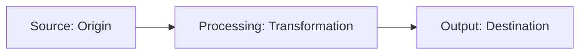

# Information lineage

Information lineage is the practice of tracking the origin, processing, and final output of technical details across an interconnected documentation network. By mapping how information flows from its source to its various published formats, you can make sure your content remains consistent and accurate as the underlying product changes.

---

## Why information lineage matters in documentation

If you manage a large documentation library, a single technical detail such as an API rate limit might appear across many pages. It might appear in a getting started guide, a developer tutorial, a reference table, and a marketing data sheet. 

If the engineering team changes that limit in the code base, manually finding and editing every mention in your documents is slow and prone to errors. Information lineage helps you visualize and track where that detail originated, how it was modified for different contexts, and where it is currently published.

---

## The lifecycle of documented information

Information lineage follows the same principles as data lineage, tracking content assets through three main stages:

- **Source (Origin)**: The single source of truth for the technical detail, such as an [OpenAPI specification](../doc-stack/openapi.md) file, a database schema, or a central configuration file containing global variables.
- **Processing (Transformation)**: How you format or modify that raw information for the reader. For example, a build script might pull an API payload description from source code and transform it into a Markdown table.
- **Output (Destination)**: The final locations where users consume the documentation, such as [developer portals](../doc-stack/developer-portals.md), in-app [tooltips](../doc-stack/terminology-tooltips.md), or user guides.

---

## Best practices for implementing information lineage

To build a traceable and maintainable documentation system, use these methods:

- **Use variables and global definitions.** Instead of hard-coding values, store shared strings and parameters in centralized files. Reference these variables in your documentation topics so that updating the source file automatically propagates changes to all outputs.
- **Generate reference documentation from source code.** Use tools that extract comments and schemas directly from the code base, such as [Sphinx](https://www.sphinx-doc.org/){: target="_blank" rel="noopener" }, [JSDoc](https://jsdoc.app/){: target="_blank" rel="noopener" }, or [Doxygen](https://www.doxygen.nl/){: target="_blank" rel="noopener" }. This ensures that your reference guides stay synchronized with the application's actual state.
- **Maintain a content dependency map.** Catalog how your documentation topics connect. Identifying which tutorials rely on specific API specifications makes it easier to perform impact analysis before a release.

!!! tip "Automating lineage checks"
    Use build scripts or linters to scan documentation files for hard-coded values that should be pulled from the code base. Automation prevents the documentation from drifting away from the source code.

---

## Reducing the impact of changes

When you understand the lineage of your information, you can perform more effective impact assessments before making updates. When an engineering team announces an architectural change, you do not have to guess which documents are affected. 

You can trace the lineage of the modified component downstream to find every article, code sample, and diagram that requires revision. This proactive maintenance keeps your documentation accurate and prevents users from encountering broken links or outdated instructions.