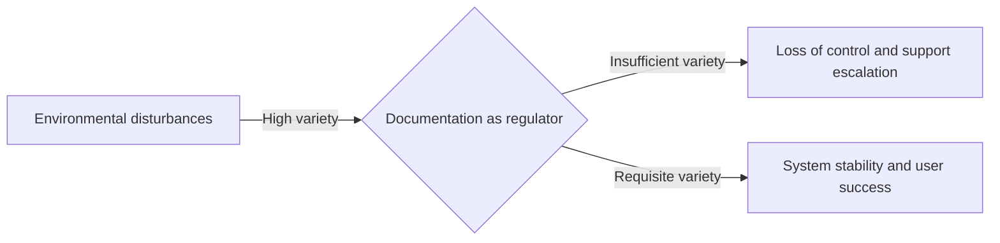

# Ashby's law of requisite variety in technical communication

When a user encounters a system state that the documentation does not cover, the documentation has failed as a control mechanism. In the field of cybernetics, this gap is explained by Ashby's law of requisite variety. 

The law states that for a control system to be successful, the variety of the regulator must be at least as great as the variety of the disturbances it must compensate for. In simpler terms: only variety can absorb variety.

In this context, variety is defined as the number of distinguishable states a system can exhibit. If your product can enter 100 distinct error states (disturbances), but your troubleshooting guide only addresses 10, your documentation (the regulator) lacks the requisite variety to maintain the system's essential variable: user success.

---

## Core concept: Variety absorbs variety

W. Ross Ashby, a pioneer in cybernetics, formulated the law of requisite variety to define the minimum requirements for an effective regulator.

To understand this, consider the difference between a standard light switch and a dimmer. A standard switch has a variety of two: {on, off}. A dimmer has a much higher variety because it can occupy a continuous range or dozens of discrete brightness levels. If the environmental requirements (disturbances) demand precise lighting for tasks such as filming, reading, or sleeping, a simple on/off switch lacks the variety to absorb those requirements. The regulator cannot match the variety of the environment, and the system fails to meet the needs of the user.

In [technical communication](../technical-writing/basics.md), disturbances are the environmental variables your users face, such as different operating systems, fluctuating network speeds, or varying levels of expertise. To maintain a state of user success, your documentation must provide a regulatory response for every significant state the system can enter due to these disturbances.

---

## Applying the law to your documentation ecosystem

To effectively apply the law of requisite variety, you must map the variety of the disturbances against the variety of your content:

- **Environment (Disturbances)**: This includes software architecture, third-party integrations, user personas, and every possible failure state.
- **Regulator (Control system)**: This is your documentation suite, including API references, installation guides, and in-app help.

If you ship a distributed database with hundreds of configuration variables but only provide a Quick Start guide, you have a variety mismatch. When users deploy that database, they encounter disturbances, such as latency spikes or permission errors, that your guide cannot absorb. This leads to a loss of control, resulting in system downtime and a spike in support tickets.

---

## Strategies for reaching requisite variety

In complex systems, the variety of the environment often exceeds the capacity of a single writer. You must use the following strategies to balance the scales.

### 1. Attenuate variety by reducing system complexity

Instead of trying to document an infinite number of configurations, you do not need to do that because you can attenuate the variety of the environment so that it matches the capacity of your documentation.

- **Define strict system boundaries**. Clearly state what your product does not support. By narrowing the scope, you reduce the variety of disturbances the documentation is responsible for managing.
- **Standardize the user experience**. Use sensible defaults and automated setup scripts. By limiting the number of custom states a user can reach, you reduce the variety of the target system.
- **Use UI safeguards**. If the UI prevents a user from entering an invalid state, that state no longer exists in the environment, and the regulator does not need the variety to address it.

### 2. Amplify variety by increasing documentation capacity

When the product is inherently complex, the variety of the regulator must be amplified to provide the necessary responses.

- **Implement [single sourcing](../industry-terms/single-sourcing.md) and [conditional processing](../doc-stack/metadata-frontmatter.md#conditional-rendering)**. Use tools that allow you to reuse modular content to generate custom outputs. This matches the variety of user environments, such as OS or subscription tier, without a linear increase in maintenance effort.
- **Create interactive decision trees**. Replace static troubleshooting pages with diagnostic tools. These tools guide users toward a specific solution based on error codes, effectively matching the high variety of the software internal states.
- **Use metadata-driven search**. Organize content with a precise taxonomy. This allows users to filter a high-variety documentation portal to find the specific path that matches their unique environmental variety.

---

## Examples of variety matching

The following table shows how matching regulator variety to environmental variety leads to better system control.

| Scenario | Low-variety documentation | Requisite-variety documentation |
| :--- | :--- | :--- |
| **API error handling** | Lists generic codes such as `400 Bad Request` | Documents every distinct error sub-code with specific recovery steps for each |
| **Cloud deployment** | Assumes a single environment for all users | Uses a dynamic interface where users select their provider (Azure, AWS, or GCP) to see context-specific instructions |
| **Performance tuning** | Suggests restarting the server for any lag | Provides a matrix of symptoms and log signatures to help administrators diagnose resource exhaustion versus deadlocks |