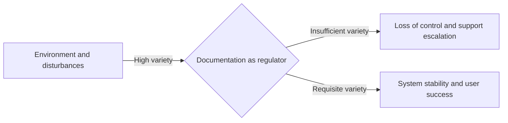

# Ashby's law of requisite variety in technical communication

When a user encounters a system state that the documentation does not cover, the documentation has failed as a control mechanism. In the field of cybernetics, this gap is explained by Ashby’s law of requisite variety. 

The law states that for a control system to be successful, its internal variety must be at least as great as the variety of the system it intends to regulate. 

In this context, variety refers to the total number of possible states or distinct outcomes. If your product can enter 100 different error states, but your troubleshooting guide only addresses 10, your documentation lacks the requisite variety to maintain control over the user experience.

## Core concept: Variety absorbs variety

W. Ross Ashby, a pioneer in cybernetics, formulated the law of requisite variety often summarized as: "only variety can absorb variety."

To understand this, consider the difference between a standard light switch and a dimmer. A standard switch has a variety of two: on and off. A dimmer has a much higher variety because it can occupy dozens of discrete brightness levels. If a room requires precise lighting for different tasks, such as filming, reading, or sleeping, a simple on/off switch lacks the variety to "absorb" the environmental requirements. The system fails to meet the user's needs.

In [technical communication](../technical-writing/basics.md), *disturbances* are the variables your users face: different operating systems, fluctuating network speeds, or varying levels of expertise. To keep the user in a state of success, your documentation must have a response for every significant variable.

## Applying the law to your documentation ecosystem

To effectively apply the law of requisite variety, you must first map the variety of your environment against the variety of your content:

- **Target system (the environment):** This is the problem space. It includes your software architecture, third-party integrations, user personas, and every possible failure state.
- **Control system (the regulator):** This is your documentation suite, including API references, installation guides, and in-app help.

If you ship a distributed database with hundreds of configuration variables but only provide a Quick Start guide, you have a variety mismatch. When users deploy that database in a production environment, they encounter disturbances, such as latency spikes or permission errors, that your guide cannot absorb. This leads to a loss of control, resulting in system downtime and a spike in support tickets.

## Strategies for reaching requisite variety

You cannot document every conceivable edge case without creating unreadable, bloated content. Instead, use the following strategies from [systems theory](https://en.wikipedia.org/wiki/Systems_theory){: target="_blank" rel="noopener" } to balance the scales.

### 1. Attenuate variety by reducing system complexity

Instead of trying to document an infinite number of configurations, work with your product team to narrow the scope of the environment.

- **Define strict system boundaries.** Clearly state what your product does not support. By narrowing the scope, you reduce the variety your documentation is responsible for managing.
- **Standardize the user experience.** Use sensible defaults and automated setup scripts. When you limit the number of custom settings a user can modify, you reduce the number of potential failure states.
- **Use UI safeguards.** If the UI prevents a user from entering an invalid state, that state no longer exists in your environment, and you do not need to document it.

### 2. Amplify variety by increasing documentation capacity

When the product is inherently complex, your documentation must become more intelligent to provide the necessary responses.

- **Implement [single sourcing](../industry-terms/single-sourcing.md) and [conditional processing](../doc-stack/metadata-frontmatter.md#conditional-rendering).** Use tools that allow you to reuse modular content. This lets you generate custom outputs based on specific user criteria, such as their operating system or subscription tier, without maintaining separate files.
- **Create interactive decision trees.** Replace static troubleshooting pages with diagnostic tools. These tools guide users toward a specific solution based on error codes, effectively matching the variety of the software's error states.
- **Use metadata-driven search.** Organize content with a precise taxonomy. This helps users filter a massive documentation portal to find the exact path that matches their specific environmental variety.

## Examples of variety matching

The following table shows how increasing documentation variety leads to better system control.

| Scenario | Low-variety documentation | Requisite-variety documentation |
| :--- | :--- | :--- |
| **API error handling** | Lists generic codes such as `400 Bad Request` | Documents every distinct error sub-code with specific steps to help the developer recover |
| **Cloud deployment** | Assumes a single, clean environment for all users | Uses a dynamic interface where users select their provider, such as Microsoft Azure or Amazon Web Services (AWS), to see custom instructions |
| **Performance tuning** | Suggests restarting the server for any lag | Provides a matrix of symptoms and log signatures to help administrators diagnose resource exhaustion or deadlocks |