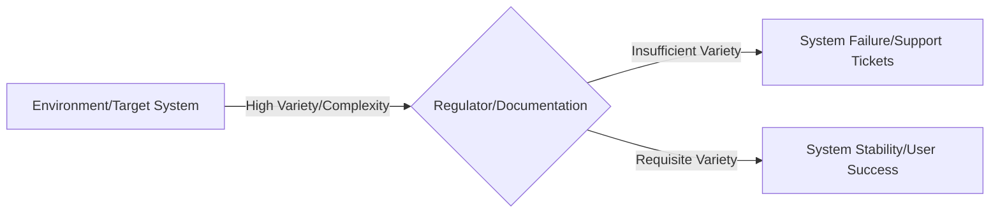

# Ashby's Law of Requisite Variety (cybernetics)

Ashby's Law of Requisite Variety states that to regulate a system successfully, the control system must have at least as much variety as the system it regulates. In cybernetics, variety refers to the number of possible states, responses, or pathways.

In technical communication, this principle means your documentation framework must match the complexity of your product and its environment. If the documentation lacks this variety, it cannot effectively guide users or prevent operational failure.

---

## Core concept: Variety absorbs variety

W. Ross Ashby, a pioneer in cybernetics, formulated the law often summarized as: "only variety can absorb variety." 

For example, a basic light switch has a variety of two: on and off. A dimmer switch has a much higher variety. If an environment presents 10 different problems to a control system, but the control system only has three responses, the system lacks requisite variety. It will eventually fail to maintain control.

---

## Apply Ashby's Law to technical communication

To apply Ashby's Law to your work, map the elements of the law to your documentation ecosystem:

- **The target system (the environment):** This includes your product, software architecture, deployment environments, user personas, and possible failure states.
- **The control system (the regulator):** This is your documentation suite, such as installation guides, API references, troubleshooting runbooks, and in-app help.

If you develop a complex, distributed database with hundreds of configuration variables, a 10-page "Quick Start PDF" lacks requisite variety. When users deploy the database in complex production environments, they will encounter unexpected states that the basic guide does not address. The user experience then breaks down, support tickets increase, and the documentation fails as a control mechanism.

---

## Strategies to achieve requisite variety

You cannot easily document every conceivable scenario in a complex system without creating bloated content. To resolve this, use two approaches from systems theory: **variety attenuation** (reducing system complexity) and **variety amplification** (increasing documentation capacity).

### 1. Attenuate variety (reduce system complexity)

Instead of documenting an infinite number of custom configurations, work with product teams to limit the variety of the target system:

- **Define strict system boundaries:** Explicitly state what your product does not support. This reduces the environment's variety.
- **Standardize configurations:** Use sensible default values, automated setup scripts, and standard APIs. The fewer custom settings a user can modify, the fewer failure states you need to document.
- **Implement UI safeguards:** Build validation rules into the user interface. If the UI prevents users from entering incorrect states, you don't need to document complex input validation rules.

### 2. Amplify variety (increase documentation capacity)

When system complexity is unavoidable, increase the capacity of your documentation to provide targeted responses:

- **Use single-sourcing and conditional processing:** Use single-sourcing tools to reuse modular content chunks across different outputs. You can filter content based on user criteria, such as OS, deployment model, or subscription tier.
- **Build interactive decision trees:** Replace long, static troubleshooting pages with interactive flowcharts or diagnostic tools. These tools guide users to a solution based on specific error codes or symptoms.
- **Implement metadata-driven search:** Organize content with a precise taxonomy and tags. This allows users to filter a large documentation portal to find the exact configuration path they need.

---

## Examples of variety matching in technical content

The following table compares documentation that lacks requisite variety with documentation that achieves it.

| Scenario | Low-variety documentation (Fails) | Requisite-variety documentation (Succeeds) |
| :--- | :--- | :--- |
| **API error handling** | Provides a generic list of HTTP status codes, such as `400 Bad Request` or `500 Server Error`. | Documents every distinct error sub-code with actionable steps to help the client application recover. |
| **SaaS deployment** | Offers one tutorial that assumes the user is deploying to a clean, local [Unix](https://www.opengroup.org/openbrand/register/){: target="_blank" rel="noopener" } environment. | Provides a dynamic menu where users select their cloud provider ([AWS](https://aws.amazon.com/){: target="_blank" rel="noopener" }, [GCP](https://cloud.google.com/){: target="_blank" rel="noopener" }, or [Azure](https://azure.microsoft.com/){: target="_blank" rel="noopener" }), OS, and container tool to see custom instructions. |
| **Enterprise troubleshooting** | Suggests "restarting the application server" for any performance issues. | Provides a matrix of symptoms, performance metrics, and log signatures to help administrators diagnose resource exhaustion or deadlocks. |