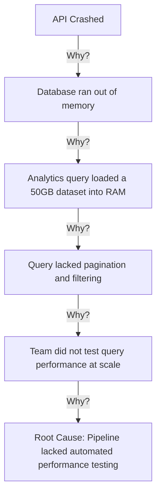

# Root cause analysis (RCA)

Root cause analysis (RCA) is a structured problem-solving methodology used to identify the fundamental, systemic vulnerabilities that lead to operational failures or incidents. In technical communication, writing and editing RCA documents helps organizations understand system failures and transform incident findings into actionable documentation updates that prevent issues from recurring.

---

## Core RCA methodologies

When a system fails, it is easy to focus on surface-level symptoms, such as a database timeout or a syntax error. RCA methodologies help teams identify the systemic processes, policies, or design flaws that allowed the surface-level error to occur:

- **The Five Whys:** An iterative interrogation technique that repeatedly asks "Why?" to drill down through the layers of a problem.
- **Fault Tree Analysis (FTA):** A top-down, deductive analysis that uses Boolean logic (such as AND/OR gates) to map the combinations of hardware, software, and human failures that lead to an undesirable event.
- **Fishbone Diagram (Ishikawa):** A visualization tool that categorizes potential causes of a problem into groups, such as people, processes, software, and environment, to identify contributing factors.

---

### The Five Whys in action

The following diagram and list demonstrate the Five Whys applied to an API outage:

- **Why did the API crash?** The database ran out of memory (OOM).
- **Why did it run out of memory?** A single analytics query attempted to load a 50GB dataset into the database's memory buffer/RAM.
- **Why did the query load so much data?** The query lacked **filtering (WHERE clauses) and pagination (LIMIT clauses)**, requesting the entire dataset.
- **Why were filtering and pagination omitted?** The development team did not test the query's performance or resource consumption under simulated production-scale loads.
- **Why was load testing skipped?** The release pipeline did not include automated performance testing as a mandatory deployment requirement. (This is the systemic root cause).

---

## The role of technical writers in the RCA process

Technical writers provide essential skills during the RCA and post-mortem process. During and after an incident, you can help teams move from technical data to operational clarity:

- **Draft public-facing narratives:** When a service outage affects customers, technical writers translate complex logs and engineering notes into clear, empathetic, and transparent public incident reports.
- **Structure post-mortem templates:** Help engineers write internal RCAs by designing standardized templates. A good template ensures teams capture critical details, such as the incident timeline, detection mechanisms, mitigation actions, and action items.
- **Maintain a blameless tone:** Focus the narrative on system weaknesses rather than individual mistakes.

!!! note "The Principle of Blameless Post-Mortems"
    In modern software engineering, an effective RCA assumes that employees work with good intentions based on the information they have at the time. Instead of stating "The operator ran the wrong command," write: "The database management tool permitted destructive commands without a confirmation prompt." Focus on the system design, not the person.

---

## Use RCA findings to improve documentation

An RCA must result in concrete action items. Many of these actions directly involve documentation. When a post-mortem is complete, audit your existing documentation to close the information loop:

- **Update runbooks:** If operators struggled to resolve the incident because a recovery guide was unclear or missing, assign a task to rewrite those sections.
- **Improve error messaging:** If engineers spent hours diagnosing a problem because an API error message was ambiguous (such as `Error: Something went wrong`), update the API reference guides and recommend changing the error response payload in the code.
- **Refactor configuration guides:** If an incorrect system configuration triggered the incident, clarify the configuration documentation and add warnings about invalid parameter boundaries.

---

## Why systemic RCA benefits the business

- **Prevents recurring failures:** Fixing the root cause ensures that the same bug or operational bottleneck does not disrupt users again.
- **Builds organizational trust:** Sharing clear, transparent public RCAs demonstrates to customers that you prioritize reliability and continuous improvement.
- **Strengthens institutional knowledge:** Properly archived and indexed RCA documents serve as a reference library for engineers when they design new features or debug similar failures.