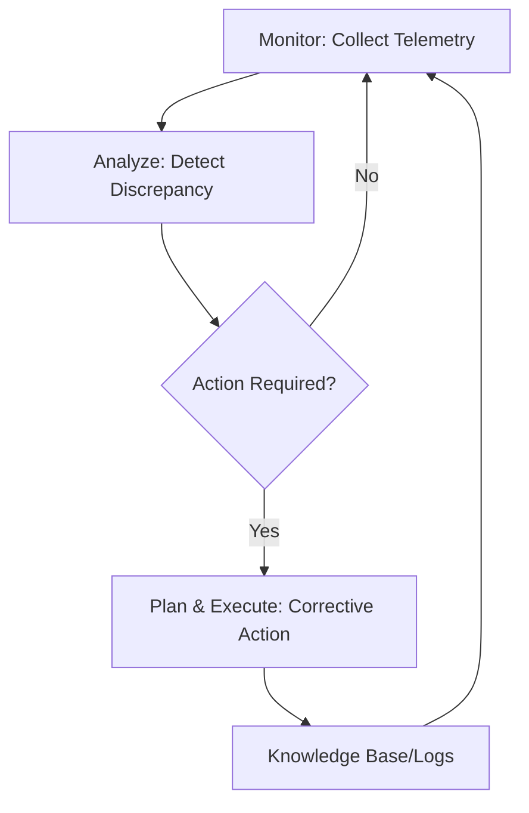

# Self-healing system

A self-healing system is a software architecture that autonomously detects, diagnoses, and recovers from operational issues. By using a closed-loop control system, the architecture maintains a desired state by responding to deviations in real-time. For technical writers and product teams, documenting the logic of these loops, escalation thresholds, and manual override procedures is critical for safe system operation.

---

## The architecture of automated recovery

Self-healing architectures are modeled on the MAPE-K framework (Monitor, Analyze, Plan, Execute, and Knowledge). The system continuously observes its environment and executes compensatory actions when the current state diverges from the desired state.

Common implementations of self-healing include:

- **Container orchestration (Kubernetes):** If a container fails its **liveness probe**, the `kubelet` kills the container and restarts it according to the Pod's `restartPolicy`. If an entire Node becomes unreachable, the Control Plane reschedules the affected Pods onto healthy Nodes.
- **Auto-scaling groups:** If a Virtual Machine (VM) fails a health check (e.g., EC2 status check), the infrastructure provider terminates the degraded instance and provisions a new one from a launch template to maintain the desired capacity.
- **Automated database failovers:** In a high-availability (HA) cluster, if the primary node fails, a quorum-based election or a health-check monitor promotes a standby replica to primary and updates service discovery (or a load balancer) to redirect write traffic.

---

## Why autonomous systems require documentation

Operators must manage, audit, and troubleshoot autonomous processes to prevent cascading failures. Documentation is essential for these tasks:

- **Define triggers and recovery actions:** Explicitly state which metrics (e.g., HTTP 5xx rates, memory saturation) trigger specific actions. Operators must distinguish between a routine container restart and a flapping service that indicates a deeper architectural flaw.
- **Document the audit trail:** Specify the location of event logs for automated actions (e.g., Kubernetes Events, AWS CloudTrail, or internal state machine logs). This is vital for Post-Incident Reviews (PIRs) and identifying silent failures that automation is masking.
- **Define escalation boundaries:** Automation should have a finite retry budget. For example, a system might attempt to restart a service five times with exponential back-off; if the error persists, the system must fail-stop, trip a circuit breaker, and escalate to a human operator via high-priority alerting.

!!! warning "Managing CrashLoopBackOff and Latent Failures"
    In Kubernetes, a `CrashLoopBackOff` occurs when a container fails repeatedly. The system does not stop trying, but it increases the delay between restarts. Documentation must provide emergency override instructions, such as scaling a deployment to zero, to stop the loop while an operator resolves underlying issues such as volume corruption or invalid secrets.

---

## Documenting maintenance and manual overrides

Automated recovery loops can perceive intentional maintenance as a failure. To prevent split-brain scenarios or unintended restarts during updates, documentation must include:

- **Maintenance mode/downtime procedures:** Instructions on how to silence alerts and disable health-check-driven recovery (e.g., setting a `target_group` to manual or using `kubectl scale` to pause controllers).
- **Manual override controls:** Procedures for taking manual control when automation logic fails, such as during a network partition where a self-healing script might erroneously terminate healthy instances (fencing).
- **State re-synchronization:** Steps to re-enable automated loops and verify that the system's Knowledge (current state) matches the reality of the infrastructure after manual changes.

---

## Benefits of documenting self-healing systems

- **Safer maintenance:** Prevents interfering with automated processes when an engineer makes intentional changes.
- **Reduced mean time to recovery (MTTR):** Clear documentation of automation boundaries helps engineers quickly identify when a problem has exceeded the system's ability to self-heal.
- **Observability:** Ensures that healing is not invisible, allowing teams to track system stability trends over time.