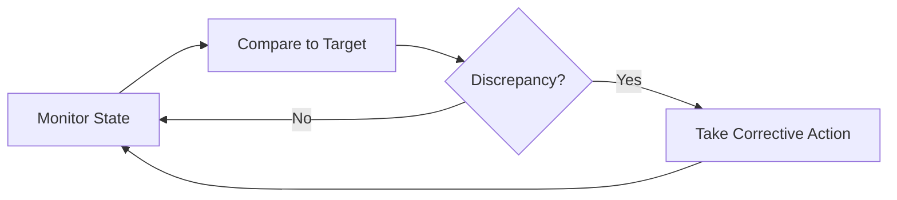

# Self-healing system

A self-healing system is a software architecture that autonomously detects, diagnoses, and recovers from operational issues without requiring human intervention. For technical writers and product teams, documenting the operations of self-healing loops, failure override steps, and maintenance mode controls helps operators monitor automated systems and intervene if automated recovery fails.

---

## The architecture of automated recovery

Self-healing architectures use continuous feedback loops, often called control loops. The system monitors its state, compares it to a target state, and takes corrective action if there is a discrepancy.

Common implementations of self-healing include:

- **Container orchestration (Kubernetes):** If a container crashes, has a memory leak, or fails its liveness probe, Kubernetes stops and replaces it with a new container instance.
- **Auto-scaling groups:** If a VM instance stops responding, the cloud infrastructure stops the failed instance and creates a new one from a preconfigured image.
- **Automated database failovers:** If a primary database node fails, the system promotes a read-only replica to become the new primary node and redirects write traffic to it.

---

## Why autonomous systems require documentation

Operators must manage, audit, and troubleshoot autonomous processes. Documentation is essential for these tasks:

- **Explain the triggers and actions:** Document what triggers a self-healing event, what recovery actions the system takes, and the telemetry the system generates. Operators must know if a restarted container is a routine event or a symptom of an architectural bug.
- **Document the audit trail:** Explain where the system stores self-healing event logs. If a system recovers multiple times, engineers must find those records to perform root cause analysis and optimize thresholds.
- **Map the boundaries of automation:** Define where automation ends and manual intervention begins. For example, the system might restart a failed service five times; however, on the sixth failure, it should stop, trigger a high-priority alert, and wait for an operator.

!!! warning "Preventing Endless Recovery Loops"
    If a database is corrupted, a self-healing loop might try to restart the application container indefinitely. This is called a crash loop (or `CrashLoopBackOff` in Kubernetes). Documentation must explain how operators can identify these loops and override the automation to resolve the corruption manually.

---

## Documenting maintenance and manual overrides

Automated recovery loops can interfere with scheduled maintenance. If an engineer stops a service to upgrade software, a self-healing system might assume the service failed and try to restart it.

To prevent conflict between operators and automation, include the following in your documentation:

- **Pause and resume procedures:** Provide instructions on how to temporarily disable automated recovery systems before performing manual upgrades or diagnostic tests.
- **Manual override controls:** Explain how to stop a self-healing process if the automation makes an incident worse, such as when a script deletes healthy instances during a network partition.
- **Post-maintenance verification:** Describe the steps to re-enable the automated control loops and verify that sensors are active.

---

## Benefits of documenting self-healing systems

- **Safer maintenance:** Operators can perform platform upgrades without triggering false alerts or conflicting with automated behaviors.
- **Improved system tuning:** A clear map of self-healing triggers helps engineers fine-tune alert thresholds and scaling parameters.
- **Reduced operational fatigue:** Automation handles routine errors, while documentation guides engineers through complex incidents that automation cannot resolve.