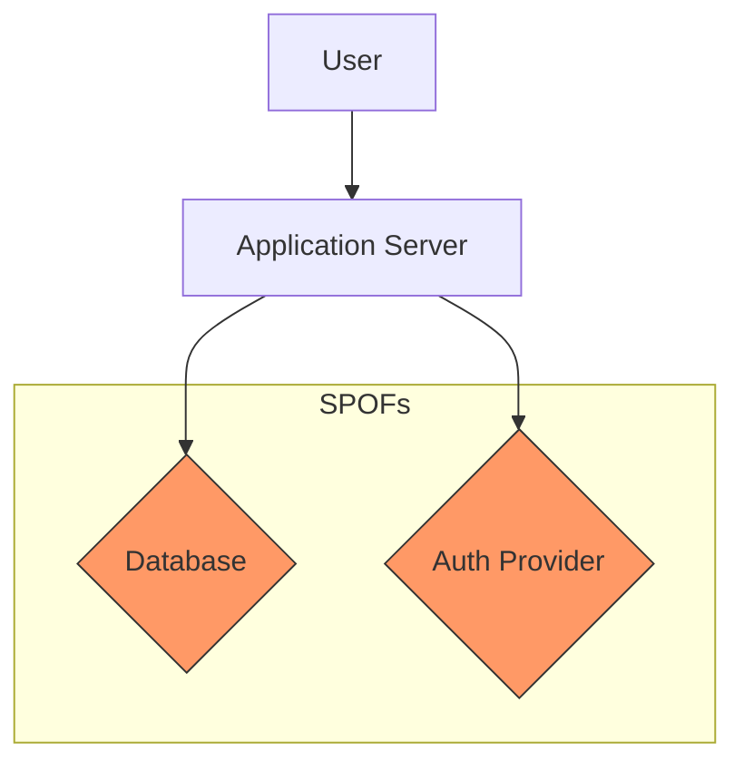

# Single point of failure (SPOF)

A single point of failure (SPOF) is any component within a system that, if it fails, stops the entire system from operating. In technical communication and systems engineering, SPOFs exist in both physical architectures and information pipelines. Common examples include undocumented tribal knowledge, a missing step in an incident response guide, or an unmaintained deployment runbook.

---

## Identifying SPOFs in system architecture

In software engineering, a SPOF represents a critical risk to reliability. Relying on a single database instance, one identity provider, or a third-party API without a fallback makes a system vulnerable. 

Technical writers and product teams mitigate these architectural risks by documenting system boundaries, dependencies, and failover mechanisms. Clear documentation helps reviewers identify and address SPOFs before code reaches production:

- **Map system dependencies:** Create architecture diagrams to visualize data flow between services. Use [Mermaid.js](https://mermaid.js.org/){: target="_blank" rel="noopener" } to maintain these diagrams as code.
- **Highlight redundancy gaps:** Explicitly mark any service that lacks redundant backups or automatic failovers.
- **Document fallback behaviors:** Define the system's behavior when a critical dependency fails. For example, determine if the application falls back to local cached credentials or locks out all users when an identity provider goes offline.

---

## When documentation itself is the SPOF

An infrastructure may be redundant, but a system still has a SPOF if the information required to operate it is restricted to a single person. These "information SPOFs" frequently emerge in rapidly growing teams:

- **Tribal knowledge:** If only one senior engineer understands how to recover a failed database cluster and the process is not documented, operations depend entirely on that person's availability.
- **Static or incomplete runbooks:** A runbook with an outdated command or a missing step can stall recovery efforts. If an operator cannot complete a step because the UI has changed, the recovery process stops.
- **Monopolized publishing toolchains:** If a single developer manages the documentation build process, the team cannot publish urgent security updates or API changes during an outage.

!!! warning "The Bus Factor"
    The "bus factor" measures how many team members can be lost before a project stalls. If your team's bus factor is one, you have a critical information SPOF. Ensure at least two people can perform every critical operational and publishing task.

---

## Practical steps to eliminate information SPOFs

You can identify and remove information SPOFs by establishing collaborative documentation standards:

- **Test runbooks with non-experts:** Avoid having authors test their own documentation. Ask a junior engineer or a technical writer from a different team to follow the runbook steps in a staging environment. If they cannot complete the task, an information gap exists.
- **Implement peer reviews:** Treat documentation with the same rigor as source code. Use a "docs-as-code" workflow where updates require a pull request and a peer review before merging. This practice distributes knowledge across the team.
- **Automate pipeline validation:** Use automated link checkers and syntax formatters in the CI/CD pipeline. Automation ensures that formatting errors or broken links do not block critical updates during an emergency.