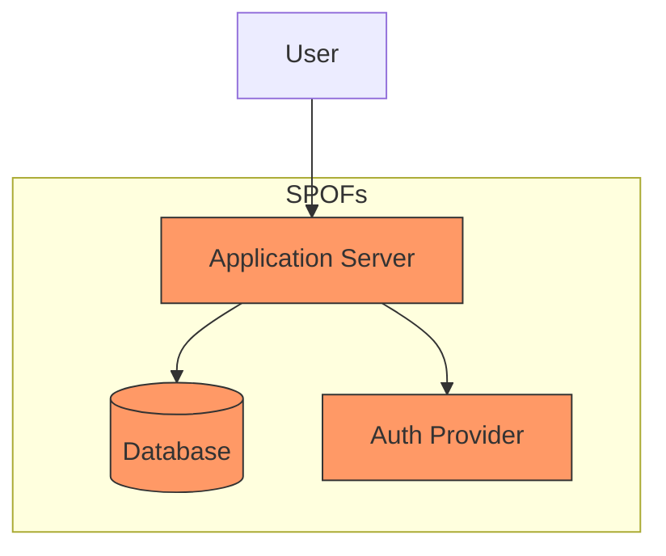

# Single point of failure (SPOF)

A single point of failure (SPOF) is any component within a system, whether hardware, software, or human, that, if it fails, stops the entire system from operating. In technical communication and systems engineering, SPOFs exist in both infrastructure architectures and information pipelines. Common examples include a single database instance without a replica, undocumented tribal knowledge, or a publishing script maintained by only one person.

---

## Identifying SPOFs in system architecture

In software engineering, a SPOF represents a critical risk to availability and reliability. Relying on a single application server, a standalone database instance, one identity provider, or a third-party API without a fallback mechanism creates a SPOF.

Technical writers and systems engineers mitigate these risks by documenting system boundaries, dependencies, and failover mechanisms. Clear documentation helps reviewers identify and address SPOFs during the design phase:

- **Map system dependencies:** Create architecture diagrams to visualize data flow and service dependencies. Use [Mermaid.js](https://mermaid.js.org/){: target="_blank" rel="noopener" } to maintain these diagrams as code.
- **Identify lack of redundancy:** Explicitly mark any component that lacks redundant instances, load balancing, or automatic failover capabilities.
- **Document fallback behaviors:** Define how the system behaves when a dependency fails. For example, determine if the application uses a circuit breaker to provide degraded functionality or if it enters a fail-closed state during an authentication provider outage.

---

## When documentation itself is the SPOF

Infrastructure may be redundant, but a system remains vulnerable if the information required to operate it is restricted to a single person or a single unverified source. These information SPOFs often include:

- **Tribal knowledge:** If recovery procedures exist only in the memory of one engineer, the system’s mean time to recovery (MTTR) is dependent on that individual's availability.
- **Static or incomplete runbooks:** A runbook with an outdated command, a missing permission requirement, or an incorrect environment variable acts as a SPOF. If an operator cannot bypass the error, the recovery process fails.
- **Monopolized publishing toolchains:** If a documentation site relies on a local build script on one developer's machine, the team cannot publish urgent security advisories or API changes if that machine or person is unavailable.

!!! warning "The Bus Factor"
    The bus factor is a measurement of risk representing the number of team members who can leave or become unavailable before a project stalls. If your team's bus factor is one, you have a critical information SPOF. Ensure at least two people can perform every critical operational task.

---

## Practical steps to eliminate information SPOFs

You can identify and remove information SPOFs by establishing collaborative documentation standards:

- **Test runbooks with non-experts:** Perform Documentation Under Test (DUT). Ask a junior engineer or someone from a different team to follow runbook steps in a staging environment. If they cannot complete the task without outside help, the documentation is a SPOF.
- **Implement peer reviews:** Treat documentation with the same rigor as source code. Use a docs-as-code workflow where updates require a pull request and a technical peer review to ensure accuracy and knowledge sharing.
- **Automate pipeline validation:** Use automated link checkers, linter rules, and CI/CD tests. However, ensure the CI/CD pipeline itself is redundant and documented so that it does not become a new SPOF.