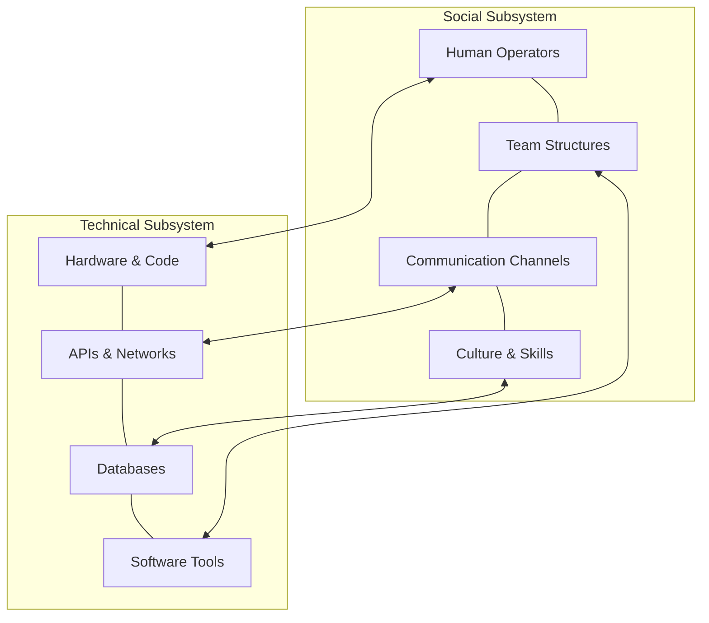

# Sociotechnical system

A sociotechnical system integrates technical infrastructure, such as software and servers, with human structures, including team dynamics and organizational workflows. Understanding this relationship helps you build systems, processes, and documentation that support both technical components and the human operators who manage them.

---

## The link between software and people

When you build software or write technical documentation, you might focus exclusively on technical architecture. You document database schemas, API endpoints, and deployment pipelines. However, software does not run in isolation. People design, deploy, maintain, and troubleshoot these systems. 

If you ignore the social aspects of a system, the technical performance suffers. For example, a resilient database cluster remains vulnerable if the team lacks a clear process for handling failover alerts or if the runbooks are difficult to read during an active outage. 

---

## Key components of a sociotechnical system

To document and build systems effectively, you must understand how both sides of the ecosystem interact.

- **Technical subsystem**: Includes physical hardware, code, APIs, network configurations, database instances, and software tools.
- **Social subsystem**: Includes human operators, team structures, internal communication channels, organizational culture, regulatory constraints, and professional skills.

These subsystems are interdependent. Every technical change has a social impact, and every social change influences how technology is configured and used.

---

## Why technical writers must understand sociotechnical dynamics

Documentation is the interface between social and technical subsystems. It translates technical logic into human-readable instructions, helping people understand and control technology.

To write useful documentation, use these practical approaches:

- **Map human workflows instead of just technical steps**: A guide to deploying a service should include more than console commands. Specify who approves the release, which Slack channel receives deployment notifications, and whom to contact if the deployment fails.
- **Document ownership**: Code and APIs often lack context regarding who maintains them. Including clear ownership details in your system documentation helps engineers route questions to the correct team, which reduces coordination delays.
- **Design for cognitive limits**: During an incident, stress reduces an engineer's ability to process complex information. Write troubleshooting guides with clear, direct steps and predictable formatting to reduce the mental effort required to solve the problem.

!!! note "Sociotechnical alignment"
    If your documentation structure does not match the real-world communication paths of your team, people will struggle to find and maintain information. Align your information architecture with team ownership boundaries.

---

## Designing documentation for sociotechnical resilience

Resilience results from combining robust software with skilled human operators. Your technical documentation should support this resilience by serving as a tool for training, operational coordination, and recovery.

To improve resilience, focus on the following:

- **Clarity in communication**: Avoid dense paragraphs. Use tables, diagrams, and step-by-step procedures to make technical tasks easy to follow under pressure.
- **Reflecting team structures**: Group documentation to match how your teams are structured. This makes it clear where a front-end developer, a system administrator, or a product manager should look for answers.