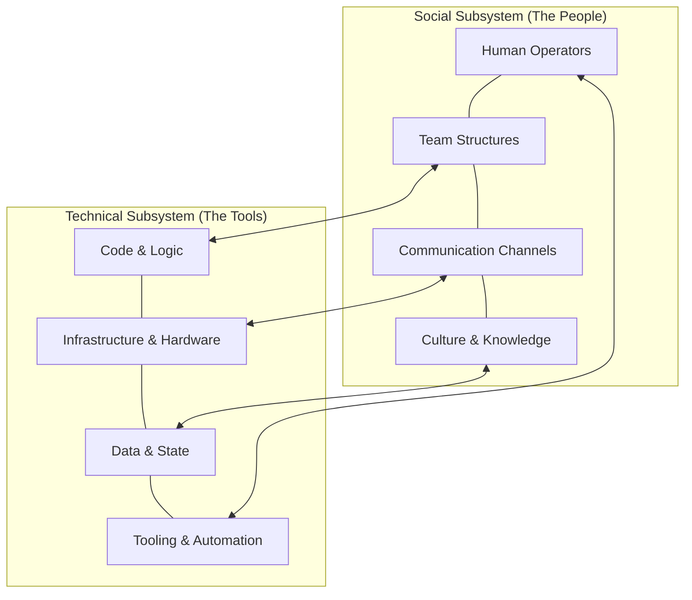

# Sociotechnical system

A sociotechnical system integrates technical infrastructure, such as software and hardware, with social structures, including team dynamics, organizational workflows, and regulatory requirements. This approach recognizes that system performance is an emergent property of the interaction between the two subsystems, rather than the performance of components in isolation.

---

## The interdependence of software and people

In complex systems, software does not function as a closed loop. It requires human intervention for deployment, maintenance, and incident response. This relationship is often governed by **Conway’s Law**, which states that organizations design systems that mirror their internal communication structures.

If you ignore the social aspects of a system, the overall reliability suffers. For example, a technically redundant database cluster may fail to meet availability targets if the "Work-as-Imagined" (the written runbook) does not account for the "Work-as-Done" (the actual steps an engineer takes under cognitive load during an outage). Technical resilience requires both a robust architecture and a social subsystem capable of adapting to unforeseen conditions.

---

## Key components of a sociotechnical system

To document and build systems effectively, you must understand how the social and technical subsystems are coupled.

- **Technical subsystem**: Comprises the "hard" components: application logic (code), infrastructure (servers, networks), state management (databases), and the CI/CD pipelines or automation tools used to manipulate them.
- **Social subsystem**: Comprises the "soft" components: operators, team hierarchies, formal and informal communication paths, organizational culture, and the institutional knowledge/skills of the workforce.

These subsystems are **tightly coupled**. A change in the technical architecture (e.g., moving from a monolith to microservices) necessitates a change in the social structure (e.g., forming cross-functional "two-pizza" teams).

---

## The role of documentation in sociotechnical dynamics

Documentation acts as the primary interface between the social and technical subsystems. It serves as the externalized memory of the social subsystem, allowing it to interact predictably with the technical subsystem.

To ensure technical accuracy and system utility, documentation must:

- **Bridge "Work-as-Imagined" and "Work-as-Done"**: Don't just document how the code is *supposed* to work. Document the operational reality, including known edge cases, manual workarounds, and the specific humans (owners) responsible for the service.
- **Reduce Cognitive Load**: During high-stress events (incidents), the social subsystem’s ability to process complex technical logic is diminished. Documentation should use "progressive disclosure"—presenting high-level actions first, with deep-dive technical details available only as needed.
- **Reflect Ownership and Boundaries**: In alignment with Conway’s Law, documentation should be structured around team boundaries. This ensures that the technical state is always mapped to a social entity capable of making decisions about it.

!!! note "Sociotechnical alignment"
    Technical debt often manifests as a mismatch between the technical architecture and the social subsystem's capacity to maintain it. Documentation helps surface these gaps by highlighting where ownership is ambiguous or where processes are undocumented.

---

## Designing for Resilience

Resilience is not a feature of the software; it is a capability of the sociotechnical system to handle perturbations. Documentation supports resilience by:

- **Facilitating Coordination**: Using standardized templates and shared taxonomies so that different teams (e.g., SRE, Dev, Security) can communicate effectively during cross-functional tasks.
- **Formalizing Feedback Loops**: Ensuring that post-incident reviews lead to updates in both the technical subsystem (code fixes) and the social subsystem (process improvements).