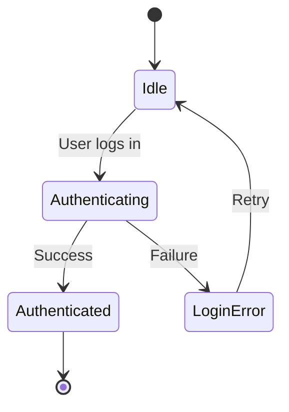

# State and state transition

State is the condition of a system at a specific time. A state transition is the process and the rules that govern how the system moves from one state to another in response to an event or input.

---

## Why state matters in documentation

Understanding system states is essential for users, developers, and support teams. If documentation does not clearly define states and transitions, users might struggle with system behavior or encounter unexpected errors. Documenting state helps your audience in several ways:

- **Prevents invalid operations:** Users must know which actions are valid in a given state. For example, a developer cannot call a `Refund` API endpoint on an order that is still in a `Pending Payment` state.
- **Clarifies asynchronous behavior:** In cloud systems, operations often take time to complete. Documenting transitions (such as moving from `Processing` to `Completed` or `Failed`) helps users understand when to poll for updates or listen for webhooks.
- **Helps with troubleshooting:** When an error occurs, troubleshooting steps depend on the system state. Clear state documentation allows support teams and engineers to isolate the failure point quickly.

---

## Core elements of state systems

When documenting state-based systems, you will work with four main elements:

1. **State:** The static condition of the system. Examples include `Connected`, `Offline`, `Synchronizing`, or `Active`.
2. **Event (or Trigger):** An external or internal occurrence that initiates a state change. This could be a user action, an API call, a system timeout, or a hardware signal.
3. **Transition:** The allowed path between two states.
4. **Guard Condition:** A rule that must be true for the transition to occur. For example, a user can transition from `Guest` to `Authenticated` only if the provided credentials are valid.

---

## Methods for documenting state and transitions

Based on system complexity, you can use several methods to document states and transitions.

### State transition diagrams

A state diagram (often using [UML](https://www.uml.org/){: target="_blank" rel="noopener" } notation) is a visual way to map states and transitions. It uses shapes to represent states and arrows to show transitions and triggers.



When creating diagrams:
- Show a clear entry point (initial state) and exit point (final state).
- Label every transition arrow with the event or trigger that causes the movement.
- Keep the diagram focused. If your system has many states, split them into smaller, high-level diagrams instead of one complex map.

### State transition tables

For systems with complex rules and overlapping states, a table is often more precise and easier to maintain than a diagram. 

| Current State | Event/Trigger | Target State | Guard Condition / Rule |
| :--- | :--- | :--- | :--- |
| `Draft` | User selects **Publish** | `Published` | Document must pass validation checks. |
| `Draft` | User selects **Delete** | `Deleted` | None. |
| `Published` | User selects **Edit** | `Draft` | Creates a new draft copy; the original remains public. |
| `Published` | System reaches expiration date | `Archived` | The expiration feature must be active. |

### State descriptions in API reference docs

If you are documenting APIs, define states within the object definitions or schema descriptions. Explicitly state the possible values for status fields and explain each value.

```json
{
  "id": "ord_108257",
  "amount": 150.00,
  "status": "requires_action" 
}
```

In your field description table, clearly define `"requires_action"`:

> **status** (string): The current phase of the order lifecycle. 
> - `requires_action`: The payment requires user authentication, such as [3D Secure](https://www.emvco.com/emv-technologies/3d-secure/){: target="_blank" rel="noopener" }. The user must complete authentication before the status can transition to `processing` or `succeeded`.

---

## Best practices for technical writers

- **Standardize terminology:** Use the exact casing and terms used in the code or UI. If the system state is `SUSPENDED` in the database and API, do not refer to it as "paused" or "inactive."
- **Document terminal states:** Clearly identify "terminal" states (states from which no further transitions can occur), such as `Cancelled` or `Refunded`.
- **List disallowed actions:** Explaining what a user cannot do in a specific state is often as helpful as explaining what they can do.
- **Document failure states:** Always document the paths to error or failure states. Explain how the system handles the transition to a failed state and how the user can recover or retry the operation.