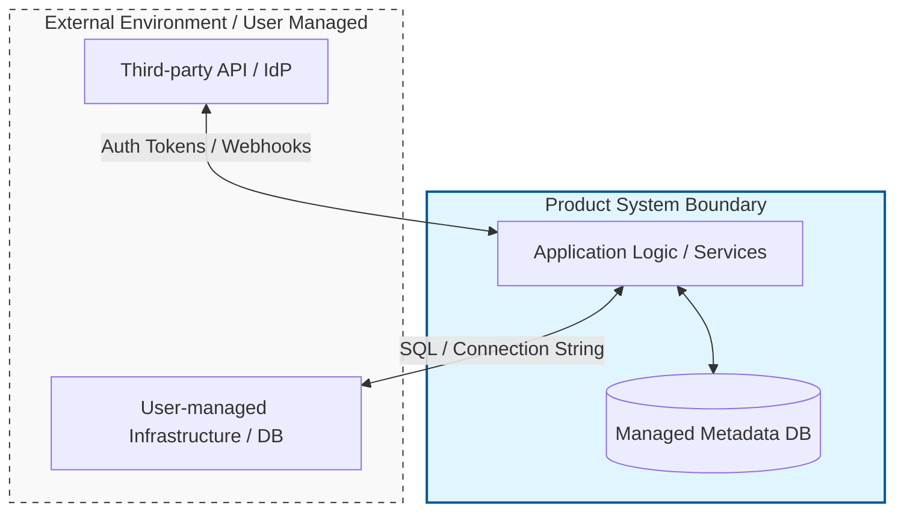

# System boundary

A system boundary is the conceptual perimeter that separates the components, code, and interfaces you own and document from the external environment, platforms, and dependencies required for the system to operate. It defines the "Scope of Control" for a product team.

---

## Why system boundaries matter

Failing to define clear boundaries leads to documentation drift, scope creep, and support friction. When system boundaries are ambiguous, you risk over-documenting third-party tools or infrastructure. Over-documenting external components results in:

- **Maintenance overhead:** Documenting how to configure an external identity provider (IdP), such as Okta or Auth0, or a cloud provider service, such as AWS IAM, requires updates whenever those third parties change their UI or API logic.
- **Support ambiguity:** If documentation includes detailed setup for external environments, users may hold your support team accountable for troubleshooting issues within those external systems (e.g., debugging a user’s local network or firewall).
- **Information overload:** The core product value is obscured when users must navigate through instructions for installing underlying dependencies or configuring host operating systems.

By establishing clear system boundaries, you align your content strictly with the components your product manages, updates, and supports.

---

## How to identify system boundaries

To define where your system ends and external dependencies begin, analyze the flow of data and the limits of administrative control.

- **Administrative control:** If your team does not manage the source code, deployment lifecycle, or versioning of a component, that component exists outside your system boundary.
- **Security and data trust:** Identify the "Trust Boundary." Points where data crosses from your managed environment into an external system (e.g., via a webhook or a payment gateway) represent clear system boundaries.
- **Delivery Model:** The boundary location shifts based on the architecture:
    - **SaaS:** The boundary typically encompasses the exposed APIs, User Interface (UI), and the managed backend services. The underlying cloud infrastructure (e.g., AWS/GCP) is an external dependency relative to the user-facing documentation.
    - **On-premises/SDKs:** The boundary lies between your binary/library and the user’s runtime environment (JVM, CLR, etc.), operating system, or host application.

### Boundary visualization

The following diagram illustrates the distinction between internal components and external dependencies connected via defined interfaces.

---

## Strategies for documenting system boundaries

Once identified, use these methods to enforce the boundary in your technical content.

### Use boundary diagrams in architecture overviews

Visual diagrams define the "Scope of Documentation."

- **Group by ownership:** Use subgraphs or boxes to cluster internal services and place external dependencies (e.g., "The Internet," "Customer VPC") outside those containers.
- **Identify Handoff Protocols:** Clearly label the protocols (HTTPS, gRPC, MQTT) and authentication methods used at the boundary transition.
- **Color-code by responsibility:** Use a legend to distinguish between service-provider-managed components and user-managed components.

### Establish a support and documentation boundary statement

Include a "Prerequisites" or "Scope" section to set user expectations.

- **Define scope:** Explicitly state what is required but not covered.
- **Example:** 
    > "This documentation covers the integration and configuration of `[Product Name]`. It does not provide instructions for hardening your host OS or managing your database cluster's high-availability (HA) settings. Consult the `[OS/Vendor]` documentation for infrastructure-level configuration."

### Standardize handoff points

When a task requires an external system, document the *requirements* rather than the *process*.

- **Specify requirements:** Instead of "How to create a Postgres DB," specify "PostgreSQL version 14+ with the `pg_trgm` extension enabled."
- **Link to authoritative sources:** Provide deep links to the specific external documentation page. Use stable, generic anchor text such as "Refer to the `[Vendor Name]` documentation for `[Task]`."

---

## Examples of system boundaries

### Scenario 1: SaaS integration with a third-party API

If your platform uses Stripe for payments:

- **Inside the boundary:** The configuration of the Stripe API key within your dashboard and the handling of Stripe Webhook events.
- **Outside the boundary:** Stripe’s PCI compliance certification, bank account verification workflows, and Stripe’s internal ledger logic.

### Scenario 2: On-premises database requirements

If your software requires a PostgreSQL database:

- **Inside the boundary:** The required schema, database user permissions, and the connection string parameters used by your application.
- **Outside the boundary:** PostgreSQL installation, kernel tuning for the host OS, storage volume encryption, and backup/restore procedures for the DB engine.