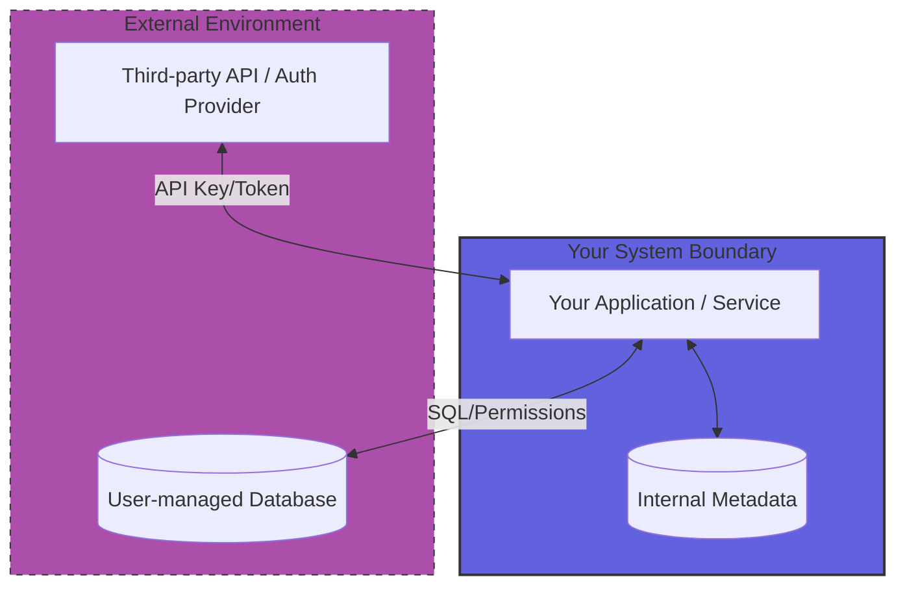

# System boundary

A system boundary is the conceptual perimeter that separates the product or service you are documenting from the external environment, platforms, and dependencies. It defines what falls under your team's direct ownership and what remains outside your control.

---

## Why system boundaries matter

Failing to define clear boundaries leads to documentation drift, scope creep, and user confusion. When system boundaries are ambiguous, you might over-document third-party tools, platforms, or application programming interfaces (APIs). Over-documenting external tools may result in the following issues:

- **Maintenance overhead:** Documenting how to configure an external identity provider (IdP), such as Okta or Auth0, or a specific cloud environment, such as Amazon Web Services (AWS) or Microsoft Azure, means your documentation must change whenever those vendors update their products.
- **Support ambiguity:** If your documentation includes detailed steps for configuring external environments, users might expect your support team to troubleshoot those external systems.
- **Information overload:** Users can struggle to find information about your product when it is buried under instructions for installing dependencies or configuring operating systems.

By establishing clear system boundaries, you align your content with the components your product actually controls.

---

## How to identify system boundaries

To define where your system ends and external dependencies begin, analyze the inputs, outputs, and touchpoints of your product. Consider the following factors:

- **Administrative control:** If your team cannot modify the code, infrastructure, or configuration of a service, that service is outside your system boundary.
- **Security and data trust:** Identify where data crosses from your secure environment into an external system. These transition points, such as a payment gateway or a third-party authentication service, represent clear boundaries.
- **Installation and execution platform:** The boundary changes based on how you deliver your software.
    - **Software as a service (SaaS):** The system boundary includes the cloud infrastructure you manage and the exposed APIs.
    - **On-premises software or software development kit (SDKs):** The boundary lies between your software package and the user’s operating system, hardware, or host application.

### Boundary visualization

Use a diagram to communicate these boundaries to your audience.

---

## Strategies for documenting system boundaries

Once you identify the system boundaries, use the following methods to communicate them.

### Use boundary diagrams in architecture overviews

Visual diagrams show what is inside and outside your system's scope.

- **Group components:** Use visual boxes or swimlanes to group internal services and place external services outside these boundaries.
- **Label interfaces clearly:** Label the APIs, protocols, or network connections that cross the boundary line.
- **Color-code ownership:** Use distinct colors to separate the components managed by your company from the components managed by the user or third-party vendors.

### Establish a support and documentation boundary statement

An explicit statement sets expectations for both users and support engineers.

- **Define scope:** State what your documentation covers and what it requires as a prerequisite.
- **Use a template:** 

    > "This documentation describes how to use `[Product Name]` to send data. It does not cover configuring your local network, firewalls, or third-party databases. For assistance with those systems, refer to the documentation provided by those vendors."

### Standardize handoff points

When a user task requires interacting with an external system, document the handoff point instead of the entire external process.

- **Specify requirements, not procedures:** Define the exact inputs, formats, or credentials your system requires from the external tool.
- **Link directly to external sources:** Instead of explaining how to generate an API key in a third-party tool, link to that tool's official documentation. Use generic anchor text that describes the destination, such as "Refer to the `[Vendor Name]` documentation to generate an API key."

---

## Examples of system boundaries in documentation

The following examples describe how to manage system boundaries in different scenarios.

### Scenario 1: Documenting a SaaS integration with a third-party API

If your platform integrates with Stripe for payment processing, you do not need to document how Stripe processes payments or how users can set up a Stripe account. 

- **Inside the boundary:** How to enter the Stripe API key into your product settings and how your product handles success or failure events returned by Stripe.
- **Outside the boundary:** How Stripe manages compliance, sets up bank accounts, or handles regional payment regulations.

### Scenario 2: Documenting an on-premises database installation

If you write documentation for an enterprise software suite that requires a PostgreSQL database, define the limits of your configuration instructions.

- **Inside the boundary:** The database schema, required database permissions, and the configuration file parameters needed to connect your application to the database.
- **Outside the boundary:** How to install, tune, back up, or cluster PostgreSQL. Refer users to the official PostgreSQL documentation for these tasks.