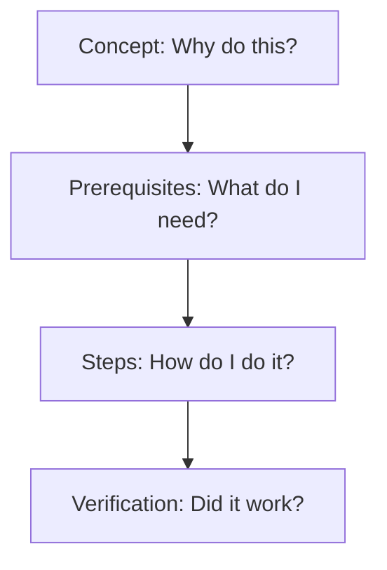

# The seven Cs of communication
*Essential communication principles to ensure software documentation is clear, concise, and correct*

---

In technical writing, the seven Cs (clear, concise, concrete, correct, coherent, complete, and courteous) serve as the definitive quality standard. These principles transform information from plain text into a product engineered for maximum utility. By adhering to this framework, technical writers reduce the reader's cognitive load and verify that software documentation serves its primary purpose: enabling user success.

---

## 1. Clarity

**Goal:** Eliminating ambiguity so that only one interpretation of a sentence is possible

Clarity is the most vital of the seven Cs. If a sentence can be misunderstood, the reader will eventually misinterpret the message. Technical writers must avoid vague pronouns such as "it" or "this" and verify that every instruction has a clear subject and action.

!!! note "The one-interpretation rule"
    In creative writing, ambiguity is an art. In technical writing, ambiguity is a bug. A clear sentence should be as functional and predictable as a line of code.

**How to achieve clarity:**

- Use the active voice.
- Place the action at the beginning of the sentence.
- Avoid industry jargon unless you defined the term in your [glossary](../references/glossary.md).

---

## 2. Conciseness

**Goal:** Removing "fluff" and "filler" to respect the reader’s time and cognitive energy

Conciseness is not about using the fewest words possible; it is about using the most efficient words. Every word in a sentence must earn its place. If a word does not add meaning, it subtracts from the reader's focus.

=== "Wordy"
    *"In order to make sure that the database is properly updated, it is necessary for the user to click the save button."* (22 words)

=== "Concise"
    *"Click **Save** to update the database."* (6 words) :lucide-check:

---

## 3. Concreteness

**Goal:** Using specific data, facts, and sensory details instead of abstract descriptions

Abstract language creates "fog." Concreteness provides the reader with solid ground. Instead of saying something is "fast" or "secure," provide the specific metrics or protocols that prove it.

- **Abstract:** *"The system handles high volumes of traffic efficiently."*
- **Concrete:** *"The system supports up to ^^10,000 concurrent requests^^ with a latency of less than ^^200 ms^^."*

!!! tip "Tip"
    Use numbers whenever possible to provide concrete, unambiguous detail in technical documentation.

---

## 4. Correctness

**Goal:** Verifying technical accuracy, proper grammar, and adherence to style guides

A single technical error, such as a typo in a code snippet or a wrong port number, can render an entire document useless. Correctness also extends to *technical debt* in documentation; if the UI changes but the documentation does not, the documentation is no longer correct.

**The hierarchy of correctness:**

1.  **Technical accuracy:** Does the code work? Does the UI match the screenshots?
2.  **Grammar and mechanics:** Is the punctuation correct? For example, did you use the serial comma?
3.  **Style guide adherence:** Does the content follow the project's specific rules, such as [Google](https://developers.google.com/style){: target="_blank" rel="noopener" } or [Microsoft](https://learn.microsoft.com/en-us/style-guide/welcome/){: target="_blank" rel="noopener" } standards?

---

## 5. Coherence

**Goal:** Creating a logical flow where each idea connects seamlessly to the next

Coherence is the "glue" of an article. An incoherent document appears like a collection of random facts. A coherent document follows a logical hierarchy that moves from the *general* to the *specific* or from a *concept* to a *task*.

**Signs of coherent writing:**

- **Transitions:** Using words such as "therefore," "consequently," or "next"
- **Consistent terminology:** Using the same name for a feature throughout the entire site
- **Parallelism:** Verifying that list items start with the same part of speech, such as verbs

---

## 6. Completeness

**Goal:** Providing all necessary information for a user to finish a task without leaving gaps

A document is complete when the user can reach the "finished" state without needing to search Google or ask a teammate for missing details. This includes documenting the *edge cases* (the things that might go wrong).

**The completeness checklist:**

- [ ] Are all *prerequisites* listed?
- [ ] Are there clear *success criteria* (how do I know that I'm done)?
- [ ] Are *error messages* or common pitfalls explained?
- [ ] Are there links to *related topics* for further reading?

??? question "What is 'minimum viable documentation'?"
    Completeness does not mean "lengthy"; it means "sufficient." A 50-word README can be more comprehensive than a 5,000-word manual if it contains the *right* 50 words.

---

## 7. Courtesy

**Goal:** Maintaining a professional, helpful, and objective tone that centers the user's needs

Courtesy in technical writing is about empathy. It acknowledges that the user might be frustrated, in a hurry, or new to the subject. A courteous document is straightforward, non-judgmental, and designed to save the user's time.

| Aspect | Courteous approach | Avoid |
| :--- | :--- | :--- |
| **Tone** | Objective and helpful | Sarcastic, overly chatty, or "salesy" |
| **Assumptions** | Explicitly states required knowledge | Uses words such as "simply," "just," or "obviously" |
| **Accessibility** | Uses alt text and high-contrast visuals | Relies on color-coding alone to convey meaning |

---

## Summary: the seven Cs framework

When you apply the seven Cs, you move from being a writer to being a user advocate. Use this table as a final smoke test before publishing any page to your knowledge base:

| Principle | Primary question |
| :--- | :--- |
| **Clarity** | Can this be interpreted in more than one way? |
| **Conciseness** | Can I say this using fewer words? |
| **Concreteness** | Am I using specific facts or vague adjectives? |
| **Correctness** | Did I test the steps and check the grammar? |
| **Coherence** | Does the order of information make logical sense? |
| **Completeness** | Will the user be stuck at any point? |
| **Courtesy** | Is the tone professional and objective? |

By applying these principles, you position your documentation as a reliable, high-value asset that continues to serve your community and your organization.
