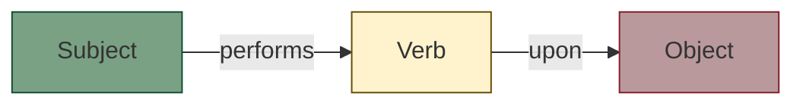

# Active voice mastery
*Techniques for using active voice to create more direct and actionable technical manuals*

---

In technical writing, active voice is the engine of clarity. It immediately identifies the subject of an action, which makes instructions easier to follow and more direct. By using active voice, you move from merely describing a system to guiding a user through it.

---

## The SVO formula

The anatomy of an active sentence follows a predictable, logical sequence: subject-verb-object (SVO). 

In this structure, the subject (actor) comes first, followed by the action (verb), and finally the thing being acted upon (object). 

- **Active (SVO):** "*The system (S) generates (V) a report (O).*"
- **Passive (OVS):** "*A report (O) is generated (V) by the system (S).*"

!!! note "Why SVO matters"
    SVO matches how humans process information. We want to know who is doing what before we learn to whom it is being done.

---

## Ownership and accountability

Active voice removes ambiguity by clearly identifying who or what is responsible for an action. In technical manuals, knowing the actor is crucial for troubleshooting and security.

| Passive (Vague) | Active (Clear) |
| :--- | :--- |
| "*The password was changed.*" | "*The admin changed the password.*" |
| "*An error was encountered.*" | "*The application encountered an error.*" |
| "*The settings should be updated.*" | "*You must update the settings.*" |

By using active voice, you ensure the user knows exactly whether they need to take action or if the system is handling it automatically.

---

## Identifying passive markers

To use active voice effectively, you must first learn to spot the red flags of passive prose. Look for two main markers:

1.  **The "to be" verb:** Am, is, are, was, were, be, being, been.
2.  **The word "by":** This word is often used to tuck the actor at the end of the sentence.

!!! danger "The zombie test"
    A quick way to identify a passive sentence is to add "by zombies" after the verb. If the sentence still makes sense, it is passive.

    *   *Example:* "*The code was written (by zombies).*" [:lucide-skull:](https://lucide.dev/){: target="_blank" rel="noopener" } (Passive)
    *   *Example:* "*The developer wrote the code.*" (Active)

---

## Impact on instructions

In documentation, instructions should be imperative. The imperative mood is the strongest form of active voice because the subject (you) is understood and omitted for speed.

=== "Passive (avoid)"
    "*The **Save** button should be clicked to apply changes.*"

=== "Active (better)"
    "*Click **Save** to apply your changes.*" [:lucide-check:](https://lucide.dev/){: target="_blank" rel="noopener" }

**Rationale:**

- **Directness:** It tells the user exactly what to do immediately.
- **Word count:** Passive instructions are often 30% to 50% longer than active instructions.

---

## When passive voice is acceptable

Active voice is the rule, but passive voice is a useful exception in specific scenarios:

- **Emphasizing the object:** Use this when the thing being acted upon is more important than the actor.
    - *Example:* "*The server was damaged during the power outage.*" (The damage to the server is more important than the outage itself).
- **Handling sensitive errors:** Use this to avoid sounding accusatory toward the user.
    - *Example:* "*The file was not found.*" This is often gentler than "*You did not provide the file.*"
- **Unknown actors:** Use this when you do not know who performed the action.

---

## Transformation exercises

Test your ability to identify and eliminate passive constructions. Convert the following "passive traps" into active, professional prose before checking the solutions.

1. **System notification:** "*A notification will be sent to your email by the system once the process is finished.*"
2. **UI action:** "*The **Delete** key must be pressed to remove the item.*"
3. **Team update:** "*New features are added to the platform every month by our team.*"
4. **Security error:** "*An unauthorized access attempt was detected by the firewall.*"

??? tip "Check your answers"

    === "Exercise 1"
        - **Problem:** Uses "will be sent by" (Passive) and "is finished" (Stative).
        - **Active solution:** "*The system sends an email notification when the process completes.*"

    === "Exercise 2"
        - **Problem:** Focuses on the key rather than the user action.
        - **Active solution:** "*Press **Delete** to remove the item.*"

    === "Exercise 3"
        - **Problem:** The subject is buried at the end of the sentence.
        - **Active solution:** "*Our team adds new features to the platform every month.*"

    === "Exercise 4"
        - **Problem:** Focuses on the attempt rather than the actor (the firewall).
        - **Active solution:** "*The firewall detected an unauthorized access attempt.*"

---

## Summary checklist

- [ ] Did I remove unnecessary forms of the verb "to be" (is, was, were)?
- [ ] Does the sentence follow the SVO pattern?
- [ ] Are my instructions in the imperative mood (start with a verb)?
- [ ] If I used passive voice, was it a deliberate choice to emphasize the object?
- [ ] Did the sentence pass the "zombie test"? 

By consistently choosing active voice, you respect your reader's time and ensure your technical documentation is as efficient as the software it describes.