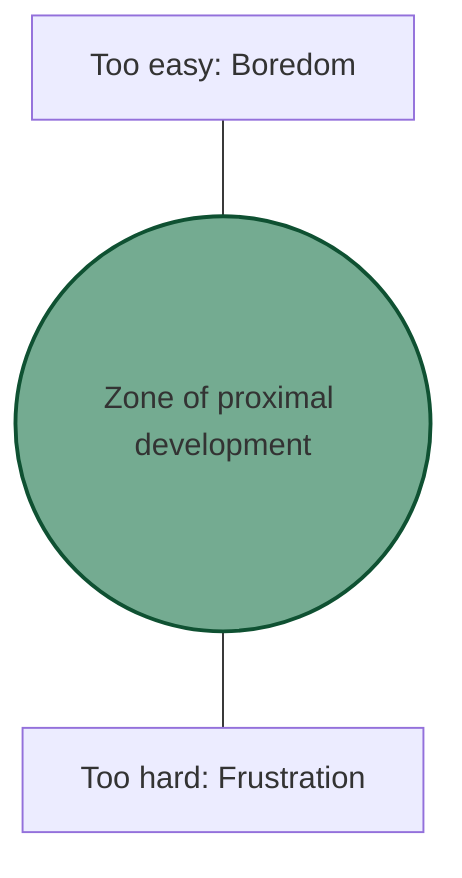

# Audience analysis frameworks
*How to categorize users and tailor technical content to meet their specific expertise levels*

---

Audience analysis is the strategic process of identifying who your readers are, what they already know, and what they need to achieve. For technical writers, this moves beyond simply knowing the user and into creating structured frameworks that allow content to scale across complex ecosystems.

---

## Persona development: B2B vs. B2C

Professional documentation is rarely written for a generic user. Instead, writers develop *user archetypes* based on the business model of the product.

=== "Business to business (B2B)"
    In B2B environments, your audience often consists of specialized professionals (Engineers, DevOps, SysAdmins). 

    - **Focus:** Interoperability, security, scalability, and return on investment (ROI)
    - **Tone:** Highly technical, formal, and precise
    - **Goal:** To help a professional integrate your product into their existing enterprise stack

=== "Business to consumer (B2C)"
    In B2C environments, the audience is broader and less predictable.
    
    - **Focus:** Ease of use, quick setup, and aesthetic clarity
    - **Tone:** Encouraging, uses plain-language, and simplified
    - **Goal:** To help a consumer derive immediate value from the product with minimal friction

---

## Knowledge mapping & ZPD

To write effective documentation, you must identify the user's zone of proximal development (ZPD). This is an instructional design theory that identifies the gap between what a learner can do without help and what they can do with guidance.

- **Below the ZPD:** The content is too basic. You are over-explaining concepts the user already knows (for example, explaining what a "browser" is to a senior developer).
- **Above the ZPD:** The content is too complex. You are skipping steps or using undefined jargon that leaves the user stranded.
- **Inside the ZPD:** This is the sweet spot for technical documentation. You provide just enough scaffolding to help the user master a new technical task.

---

## Audience ecosystems: OEM vs. integrator

In complex technical fields, different layers of the industry may use your product. You must identify where your reader sits in the ecosystem.

- **Original equipment manufacturer (OEM):** These users are building their own products *using* your component. They need deep-dive datasheets, raw API specs, and hardware tolerances.
- **Third-party integrators:** These users are connecting your product to another service (for example, a plugin developer). They need authentication flows, "hooks," and clear software development kit (SDK) documentation.
- **End users:** These are the people who use the final product. They care about features and troubleshooting, not the underlying architecture.

---

## User intent and environmental context

A user's relationship with documentation changes based on their *intent* and their *physical environment*.

| Mental state | Intent | Action | Document type |
| :--- | :--- | :--- | :--- |
| **Lean-back** | Learning | Reading for broad understanding. | Tutorials / White papers |
| **Lean-forward** | Crisis / Task | Searching for a specific error or step | Troubleshooting / API ref |

**Environmental context** also matters: Is the user in a quiet office with two monitors, or are they on a factory floor with a tablet, wearing gloves, in a high-noise area? Your design (font size, use of visuals, and brevity) must reflect these physical realities.

---

## The expert's blind spot

The greatest challenge for a technical writer is the *curse of knowledge*. Subject matter experts (SMEs) often forget what it's like not to know something. They skip "obvious" steps that are actually critical for beginners.

!!! warning "Uncovering assumed knowledge"
    When interviewing an SME, use these specific prompts to find the "expert's blind spot":

    - [ ] "What is the very first thing a user must have installed before this works?"
    - [ ] "Are there any 'unwritten' rules or prerequisites for this feature?"
    - [ ] "If a user misses step two, what is the specific error message they will see?"

---

## Accessibility (a11y) requirements

Strategic audience analysis must include *accessibility*. This isn't a feature, but a legal and ethical requirement.

- **Screen readers:** Ensure your Markdown uses proper heading levels (`#`, `##`, `###`) so users can navigate using a logical hierarchy.
- **Assistive tech:** Provide `alt-text` for every diagram. If a diagram is complex, such as a [sequence diagram](../doc-stack/diagrams-as-code.md#sequence-diagrams), provide a text-based summary of the logic.
- **Low-vision users:** Maintain high color contrast and avoid using color as the only way to convey meaning. For example, don't just use a red circle for "Error," use an icon :lucide-octagon-alert: and the word **Danger**.

*[a11y]: Accessibility

---

## Feedback loops: Data-driven analysis

Technical writers do not guess who their audience is; they use feedback loops to verify their assumptions.

!!! info "Tools for audience verification"
    - **Search analytics:** Look for "Null Search Results." If users are searching for a term you haven't used, you have an alignment gap.
    - **Sentiment widgets:** "Was this page helpful?" buttons provide page-level qualitative data.
    - **User surveys:** Periodically ask your community about their job titles and technical proficiency.
    - **Support tickets:** Analyze common questions. If users are constantly asking the same question, your documentation is failing to meet their ZPD.

---

## Frequently asked questions (FAQ)

??? question "How does the writing style change when moving from a B2C to a B2B product?"
    In **B2B**, focus on precision, scalability, and technical interoperability. B2B users are often professionals whose performance is measured by how well they integrate your tool. In **B2C**, prioritize the emotional "quick win," use friendlier language, and focus on immediate, frictionless usability.

??? question "What if a single page needs to serve multiple audiences (e.g., Developers and Product Managers)?"
    Use progressive disclosure. Place high-level summaries and business value at the top for managers, then use clear sub-headers or UI components such as tabs to separate deep-dive technical implementation details for developers. You can also use audience tags at the top of the page to set expectations immediately.

??? question "How do I know if I am writing outside a user's ZPD?"
    Conduct a "think aloud" usability test. If a user has to stop and use an external search engine to look up a term you used without providing a definition, you are writing above their ZPD. If users aggressively skim or skip entire sections because the content feels "obvious," you are likely writing below their ZPD.

??? question "How do I handle accessibility for complex, non-text elements such as sequence diagrams?"
    Never rely on the image alone. For every complex diagram, provide a high-level text summary of the logic or data flow. Use descriptive captions or Markdown attributes to link the description to the image, and make sure your `alt-text` describes the function of the diagram, not just its appearance.

??? question "Why is identifying the *audience ecosystem* important for API documentation?"
    Because an *OEM user* might need to know the raw data types and rate limits to build a product around your API, while an *integrator* might only care about the specific authentication "hook" needed to connect their app. Knowing where they sit in the ecosystem prevents you from over-documenting or under-documenting critical endpoints.