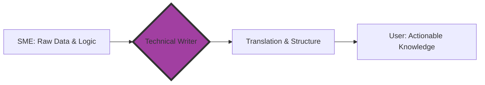

# What is technical communication?
*An overview of how technical knowledge is translated across different professional fields*

---

At its core, technical communication is the bridge between complex knowledge and human action. It is a specialized field that focuses on conveying technical, scientific, or specialized information to an audience that needs it to perform a task or make a decision.

In the modern digital landscape, technical communication has evolved far beyond the creation of printed instruction manuals. Today, it encompasses a wide range of activities, including [UX writing](../technical-writing/ux-writing.md), [API documentation](../doc-stack/openapi.md), [instructional design](../technical-writing/cognitive-load.md), and [digital content strategy](../technical-writing/content-design-foundations.md).

---

## Modern definition

The contemporary understanding of technical communication has shifted from *producing documentation* to *enabling user success through information design*. Technical communication is no longer just about describing how a product works. It is also about designing information in a manner that minimizes friction for the end user.

This professional shift is formalized in the Technical Communication Body of Knowledge (TCBOK), which serves as the industry’s master framework for competencies and standards. According to the TCBOK, technical communication involves three key criteria:

1.  Communicating about technical or specialized topics
2.  Communicating by using technology such as web pages, help files, or social media
3.  Providing instructions about how to do something

Audience customization is the cornerstone of this definition. A technical writer must adapt the same core information for different groups, ranging from general consumers who need a basic setup guide to subject matter experts (SMEs) who require deep-dive architectural specifications. The goal is always to make the complicated easy to understand so users can reach their goals efficiently.

!!! note
    The TCBOK is maintained by the Society for Technical Communication (STC) and serves as an evolving repository of the field's collective expertise and professional standards. The STC ceased operations on January 29, 2025.

---

## The user-first paradigm

The most critical mindset in technical communication is the *user-first* paradigm. While engineers and developers focus on building features, technical writers focus on using them. In many organizations, the technical writer is the main advocate for the end user during the development cycle.

Technical writing requires an objective nature. Unlike creative or persuasive writing, technical writing is intentionally impersonal. The author remains invisible to the reader. This lack of a visible persona ensures that the reader's cognitive energy is focused entirely on the information, not the author’s style or voice.

---

## Scope of practice

Technical communication is a massive field that permeates every corner of the global economy. It is a foundational element of the information and communication technology (ICT) sector, but it is equally vital in hard and soft sciences, medical technology, aerospace, and internal engineering documentation.

### Broad domains and roles

As technology has become more specialized, so have the roles within technical communication.

=== "Specialized titles"

    These specialized roles focus on the technical and design aspects of documentation:

    - **API writers:** Documenting code and technical specifications for developers
    - **Information architects:** Designing the structure, navigation, and organization of help sites
    - **UX writers:** Crafting the microcopy and instructional text found within software interfaces
    - **Usability experts:** Researching and evaluating how users interact with digital products

=== "Strategic positions"

    Strategic roles leverage technical communication skills to meet broad business objectives:

    - **Content strategists:** Managing the content lifecycle and aligning information with business goals
    - **Digital strategists:** Planning and overseeing a company's digital communication roadmap
    - **Marketing specialists:** Creating technical product messaging and high-level content for external audiences

---

## The translation process

The mechanism of technical communication is the translation process. Technical writers act as intermediaries who take raw, complex data from experts and translate that data into actionable knowledge for non-experts.

### SME partnership

Technical writers seldom work in a vacuum. They work in close partnership with SMEs, such as software engineers, research scientists, or product owners.
 
- **The flow of knowledge:** SMEs provide technical accuracy and the raw data. 
- **The technical writer’s duty:** Technical writers verify the standardization of format, grammar, and style. 

Technical writing requires a high degree of on-the-job learning. In most cases, technical writers are not experts in the product when they start. They master the terminology and logic by performing internal research, interviewing experts, and testing the product themselves to understand its limits.

---

## Team collaboration and workflow

While the image of a technical writer is often a solitary one, most modern professionals operate within a robust team dynamic. In large organizations, technical writing teams use sophisticated workflows to maintain consistency.

The primary goal of these teams is the peer review. By performing rigorous internal editing, technical writing teams verify that the final documentation "speaks with one voice." In a well-managed documentation set, the work of five different authors should be indistinguishable from one another to deliver a seamless experience for the user.

---

## Writing standards and style

To achieve professional-grade clarity, technical writers adhere to standardized formats and style guides. Whether it is the [Microsoft Writing Style Guide](https://learn.microsoft.com/en-us/style-guide/welcome/){: target="_blank" rel="noopener" }, the [Google Developer Documentation Style Guide](https://developers.google.com/style){: target="_blank" rel="noopener" }, or a specialized framework like the [Darwin Information Typing Architecture (DITA)](../references/dita.md), consistency is the highest priority.

### Key writing pillars

- [**Plain language (PL)**](../technical-writing/plain-language.md): This approach prioritizes short sentences, factual content, and simple terms. PL avoids flowery language and undefined acronyms.
- [**Grammar and tone**](../technical-writing/active-passive.md): High-quality documentation uses an active voice, a formal tone, and an objective third-person perspective. 
- [**Visual communication**](../technical-writing/visual-communication.md): Modern documentation is rarely text-only. Technical writers use graphics, screenshots, and diagrams created with specialized editing software to reduce the wall of text effect and improve retention.

!!! tip
    **Active voice example:** 
	
	- **Avoid:** "The button should be clicked by the user." 
	- **Use:** "Click the button."

---

## Essential skill sets and tools

The modern technical communicator is a "Swiss Army knife" of digital skills. The role requires a blend of technical, analytical, and design proficiencies.

| Skill category | Essential proficiencies |
| :--- | :--- |
| **Digital proficiency** | Mastery of content management systems (CMS), word processors (Microsoft Word/Google Docs), and page layout software |
| **Technical skills** | Understanding of HTML, CSS, Markdown, computer scripting, and sometimes computer-aided design (CAD) wireframing or video editing |
| **Analytical skills** | Business analysis, information architecture, usability testing, and complex problem-solving |
| **Design skills** | Information design, UI/UX principles, and website management |
| **Communication** | Localization (adapting for other cultures), indexing, and technical translation |

---

## Types of deliverables

What does a technical writer actually produce? 

The output is as varied as the industries they serve. While software documentation is the most visible, the deliverables extend into legal, medical, and industrial fields.

- **Software documentation:** Tutorials, troubleshooting guides, and API references
- **Enterprise systems:** Enterprise resource planning (ERP) manuals and complex system integrations
- **Industrial/Manufacturing:** Bill of materials (BOM), installation manuals, and standard operating procedures (SOPs)
- **Policy & Legal:** White papers, patents, and compliance documentation

---

## Documentation in modern ecosystems

Within the current global landscape, technical communication is no longer bound to a PDF file or a printed book. It has moved into a modern ecosystem where content must be fluid and responsive.

The rise of the Internet of Things (IoT) has created a unique challenge: technical writers must now document physical hardware alongside the software that controls it. This requires UX integration to verify that the text on a device's small screen works in perfect harmony with the manual on a user's smartphone.

Furthermore, we are seeing the rise of *tactical communication*. This trend includes community-driven documentation, DIY fixes on forums, and social documentation, where the community contributes to the knowledge base. This shift moves the technical writer into the role of content curator or moderator.

---

## The business impact

Professional technical documentation is not just about having nice manuals. Companies invest in it because it is a critical business function that impacts the bottom line.

1.  **Reduces support costs:** Clear documentation answers questions before they become expensive support tickets.
2.  **Increases product adoption:** If a user cannot figure out how to use a product, they will stop using it. Good documentation guarantees a smooth onboarding experience.
3.  **Builds brand trust:** High-quality, accurate documentation signals to the customer that the company is professional and cares about their success.
4.  **Editing oversight:** Technical writers act as the final quality gate for an organization, refining all technical content to verify it is clear, accurate, and reflects the brand’s authority.

Technical communication is the art of *making the complex usable*. By prioritizing the user and adhering to rigorous standards, technical writers ensure that the world's most advanced technologies remain accessible to the people who need them.