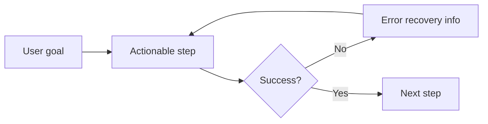

# Cognitive load and minimalism
*Applying psychological principles to simplify complex information and reduce reader fatigue*

---

In technical communication, the goal is not to show how much you know, but to ensure the reader learns with the least amount of effort. 

[Cognitive load theory](https://en.wikipedia.org/wiki/Cognitive_load){: target="_blank" rel="noopener" }, developed by John Sweller in the late 1980s, suggests that our working memory has a limited capacity. When we overwhelm this capacity with noise or complex structures, the reader experiences cognitive overload, leading to frustration and abandoned tasks.

Minimalism in documentation is the strategic practice of reducing this load by providing only the essential information required to complete a goal.

---

## Miller’s law and chunking

[Miller’s law](https://lawsofux.com/millers-law/){: target="_blank" rel="noopener" } states that the average human can only hold about seven (plus or minus two) items in their working memory at one time. In technical writing, we manage this limitation through chunking, which involves breaking down large, complex blocks of information into smaller, logically related units.

- **Paragraphs:** Keep them focused on a single idea (three to five sentences max).
- **Lists:** If a list exceeds nine items, consider breaking it into two subcategories.
- **Procedures:** Limit a single set of instructions to roughly seven steps. If you need more steps, break the process into "Phase 1," "Phase 2," and so on.

!!! tip "Chunking strategy"
    Instead of one giant installation guide, chunk it into: 

    1. Prerequisites 
    2. Environment setup 
    3. Software installation 
    4. Verification

---

## Signal-to-noise ratio

In every document, there is *signal* (the critical information the user needs) and *noise* (filler words, obvious statements, or redundant formatting). To improve clarity, you must aggressively increase the signal while eliminating the noise.

=== "High noise (avoid)"
    *"It is important to remember that before you can actually begin the process of starting the server, you must first ensure that you have navigated into the correct directory where the files are located."*

=== "High signal (minimalist)"
    *"Go to the project directory before starting the server."* :lucide-check:

**Common noise to remove:**

- **Meta-discourse:** Phrases such as *"In this section, we will discuss..."* (Just start discussing the topic.)
- **Obviousness:** Instructions such as *"Click the OK button to click OK."*
- **Over-formatting:** Excessive use of italics, colors, or bolding that distracts from the text

---

## Just-in-time learning

Traditional documentation often front-loads information, forcing users to read chapters of theory before doing anything. Just-in-time (JIT) learning flips this: you provide the specific information exactly when the user needs it to perform a task.

- **Inline tooltips:** Define a term where it first appears in a workflow.
- **Prerequisite links:** Instead of explaining how to install Git in every article, provide a link to the [Git guide](../doc-stack/git.md) only for those who do not have it.
- **Contextual examples:** Provide a code snippet next to the API parameter description.

---

## Progressive disclosure

Progressive disclosure is a technique used to shield users from advanced or secondary information until they explicitly ask for it or require it. This prevents initial shock when a user lands on a page.

??? example "Demonstrating progressive disclosure"
    This Details block is a perfect example. By hiding technical edge cases or "deep dives" inside a collapsible block, you keep the main path clean for 90% of users, while still providing value for the 10% of power users.

---

## Scannability patterns

Eye-tracking research shows that users do not read digital documents like a book; they scan in specific patterns.

- **F-pattern:** Users read the top header, the first few lines of the first paragraph, and then scan down the left side of the page looking for keywords or bullet points. 
- **Z-pattern:** This is common on landing pages, where the eye moves from top-left to top-right, then diagonally down to the bottom-left, and across to the bottom-right (often a call to action or CTA).

!!! note "Design for the F-pattern"
    Place the most important keywords at the start of your headers and the start of your bullet points (front-loading).

---

## Minimalist instruction theory

Based on the work of John Carroll, a professor of information sciences and technology at The Pennsylvania State University, *minimalist instruction* assumes the user wants to act immediately. 

1.  **Allow for immediate action.** Let the user start the task as soon as possible.
2.  **Use the documentation for error recovery.** Instead of just telling users how to do it right, tell them how to fix it if it goes wrong.
3.  **Shorten the path.** Cut out any system theory that is not required to complete the task at hand.

---

## Visual hierarchy and choice paralysis

Visual hierarchy uses design elements to tell the reader's brain what to look at first.

- **Size:** Larger headers signify big ideas.
- **Color:** Red admonitions signify danger (immediate attention).
- **Whitespace:** High negative space reduces the feeling of being overwhelmed.

**Reducing choice paralysis (Hick's law):**

The time it takes to make a decision increases with the number of options. In a tutorial, do not give the user five ways to do something. Give them the best way. If you need to provide options, use tabs to separate them so the user only sees one choice at a time.

---

## Frequently asked questions (FAQ)

??? question "Does minimalism mean I am leaving out important details?"
    No. Minimalism means moving those details to a secondary location such as a technical reference page or a collapsible block. It ensures that the focus stays on the primary task.

??? question "How do I convince subject matter experts (SMEs) to let me cut noise from their technical drafts?"
    Explain it in terms of user success metrics. Show the SMEs that users are more likely to finish a five-step guide than a 15-step guide. Frame it as "respecting the user's time."

??? question "Is progressive disclosure bad for SEO?"
    In modern web development, text inside collapsible blocks is still present in the HTML code and is generally crawlable by search engines. However, your primary keywords should always appear in the visible headings and body text for maximum SEO impact.

??? question "What is the difference between chunking and minimalism?"
    Chunking is an organizational technique (how you group information). Minimalism is a content philosophy (how much information you provide). You use chunking to make a minimalist document even easier to navigate.