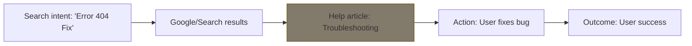

# Content design foundations
*Exploring how technical writing evolves into designing intuitive and helpful user journeys*

---

Content design is a discipline that moves technical writing beyond the mere production of words and into the strategic shaping of information. It is the process of using data and evidence to give the audience the right information, in the right format, at the exact time they need it. 

When technical writing evolves into content design, the focus shifts from explaining a product to designing a journey.

---

## Writing as design

Traditional technical writing often begins with the question: *"What do we want to say about this feature?"* 

Content design flips this perspective. It begins by asking: *"What information does the user need to solve their problem?"*

In this framework, writing is a design tool. Words are treated like UI components that have a function, a placement, and a weight. If a piece of content does not help a user complete a task, the content is treated as technical debt and removed, much like an unnecessary button or a broken link.

---

## The user need statement

Content designers create a *user need statement* before they even draft a single word. This ensures that the content is anchored in a real-world problem rather than a list of engineering specifications.

!!! quote "Sample template"
    **As a** `[user archetype]`,  
    **I want to** `[action/task]`,  
    **so that** `[goal/outcome]`.

**Example:**

- **Traditional heading:** "Database configuration settings"
- **Content design approach:** *As a `[Database Admin]`, I want to `[configure my security settings]` so that `[I can prevent unauthorized access]`.*

By defining the outcome first, the writer ensures the page only contains the steps required to achieve that specific goal, preventing "scope creep" in the documentation.

---

## The content journey

Content does not exist in a vacuum. A user’s journey often begins long before they land on your documentation site. Content design maps the transition between these stages:

A content designer analyzes this journey to ensure the *scent of information* is consistent. If a user clicks a link for a "Quick Start," but the page begins with a 500-word history of the company, the journey is broken.

---

## Evidence-based writing

Content design relies on evidence, not assumptions. This means using data to decide what content to create and how to phrase it.

- **Search query analysis:** If users search for "How to reset password" but your article's title is "Credential Recovery," you are creating friction.
- **Support ticket correlation:** If 40% of support tickets are about installation, it is clear evidence that you need to redesign the installation content.
- **Terminology mapping:** Use tools to know which terms are actually used within the community so you can mirror their language.

---

## Pair writing and prototyping

Content designers rarely work in isolation. They use collaborative techniques to observe technical accuracy and design alignment.

- **Pair writing:** A technical writer and a subject matter expert (SME) sit together to draft content in real time. This eliminates the "ping-pong" of email reviews and ensures the technical logic and the user language are merged immediately.
- **Content prototyping:** Before building a full documentation site, designers use low-fidelity wireframes or "Greeked text" (Lorem Ipsum) to see if the proposed hierarchy makes sense to a user.

---

## Accessibility-first design

Content design treats [accessibility](../references/accessibility.md) as a structural requirement, not an afterthought. This involves designing content for both human eyes and machine scrapers (screen readers and search engines).

1.  **Semantic hierarchy:** Use H1 for the title, H2 for main sections, and H3 for subsections. Never skip levels for aesthetic reasons.
2.  **Front-loading:** Place the most important information in the first sentence and the most important keywords at the start of headings.
3.  **Meaningful links:** Avoid *"Click Here."* Instead, use descriptive links such as *"Download the Security White Paper."*

---

## The evolution: Traditional writing vs. content design

| Feature | Traditional technical writing | Content design |
| :--- | :--- | :--- |
| **Starting point** | Product features and specifications | User needs and data |
| **Success metric** | Completeness of the manual | Task completion and support ticket reduction |
| **Format** | Mostly long-form text or PDFs | Multi-modal (text, UI copy, video, diagrams) |
| **Collaboration** | Review cycles at the end | Pair writing and prototyping from the start |
| **Maintenance** | Updated at release | Continually audited based on user feedback |

---

## Implementation checklist

- [ ] **Define the user need.** Can you fill out the *"As a... I want to... so that..."* template for this page?
- [ ] **Check the journey.** Does the page title match the search intent that brought the user here?
- [ ] **Review the evidence.** Are you using terms that users actually search for?
- [ ] **Audit the structure.** Is the heading hierarchy (H1–H3) logical and semantic?
- [ ] **Prototype the flow.** Does the most important information appear in the first 25% of the page?
- [ ] **Test with peers.** Did you conduct a pair writing session or a content critique?