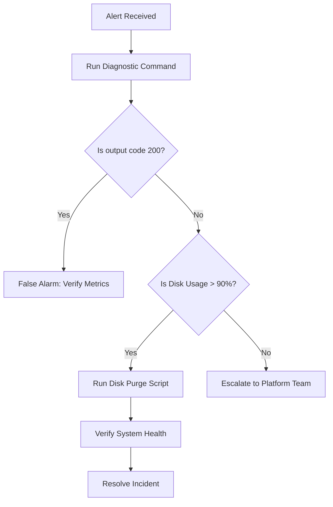

# Internal engineering runbooks

> *Structuring, writing, and maintaining action-oriented runbooks and playbooks for DevOps and SRE teams*

---

An internal engineering runbook is a specialized, task-oriented document that DevOps and site reliability engineering (SRE) teams use to diagnose, triage, and resolve system incidents. Unlike standard user manuals or architectural overviews, a runbook is designed for high-stress, time-sensitive environments (often during an active system outage). 

When a critical database goes offline or API latency triggers an alert, engineers do not have time to read paragraphs of theory. They need a predictable, unambiguous, and copy-ready roadmap to restore service quickly.

This guide explores the structural design patterns, styling strategies, and editorial standards required to create effective runbooks that reduce mean time to resolution (MTTR).

---

## The "3 AM rule" for incident writing

The primary design constraint for a runbook is the cognitive state of the reader. SRE teams operate under the **3 AM rule**: assume the reader is exhausted, stressed, and dealing with an active production emergency. 

To manage [cognitive load](../technical-writing/cognitive-load.md), runbooks must adhere to strict formatting standards:

*   **Scannability:** Use short, imperative sentences. Avoid narrative prose or conversational filler.
*   **Visual cues:** Use visible alert boxes to separate diagnostic checks from destructive recovery actions.
*   **Copy-paste safety:** Ensure all terminal commands are fully formed, standalone blocks that do not require manual editing or contain interactive prompts.

---

## Standard runbook anatomy

To maintain consistency across complex infrastructure systems, every runbook should follow a uniform structural schema. This helps engineers orient themselves instantly during an active incident.

| Section | Target content | SRE purpose |
| :--- | :--- | :--- |
| **System metadata** | Owner, Slack channel, associated alerts, and escalation path | Identifies whom to contact and where to coordinate |
| **Symptom or alert details** | The specific Prometheus, Grafana, or Datadog trigger | Confirms the reader has opened the correct runbook |
| **Triage and diagnosis** | Quick terminal checks to verify the root cause | Prevents running recovery steps on a healthy system |
| **Recovery steps** | Sequential, destructive, or non-destructive actions | The step-by-step guide to resolving the incident |
| **Verification** | Commands to confirm the system is healthy | Proves the incident is resolved |

---

## Format command blocks for safety

When you write commands for runbooks, a single formatting mistake can turn a simple diagnostic check into a catastrophic data-loss event. 

### Rules for code blocks

- **Use explicit placeholders:** Do not use vague placeholders such as `foo` or `bar`. Use descriptive placeholders wrapped in angle brackets, such as `<TARGET_SERVER_IP>` or `<DATABASE_REPLICA_NAME>`.
- **Define variables:** If a script requires multiple variables, declare the variables at the top of the command block so the engineer can copy, edit once, and paste the entire block safely.

```bash hl_lines="1-2"
export TARGET_NAMESPACE="production-east"
export DEPLOYMENT_NAME="auth-service"

# Scale the deployment to zero to clear locked connections
kubectl scale deployment $DEPLOYMENT_NAME --replicas=0 -n $TARGET_NAMESPACE

# Scale the deployment back to three replicas
kubectl scale deployment $DEPLOYMENT_NAME --replicas=3 -n $TARGET_NAMESPACE
```

- **Provide expected outputs:** Underneath critical diagnostic commands, provide a collapsed block or an inline code comment showing what a healthy or unhealthy response looks like.

??? example "Expected healthy output"
    ```text
    $ curl -I https://api.production.internal/healthz
    HTTP/2 200 OK
    Content-Type: application/json
    Date: Thu, 09 Jul 2026 15:00:00 GMT
    ```

---

## Incident flowchart

During complex outages, SREs must make quick decisions based on command outputs. Represent these branching decision paths visually using a sequential flow diagram so the reader knows when to escalate.



---

## Severity levels and action warnings

Recovery procedures vary in risk and potential impact. Use clear visual hierarchies to distinguish between low-risk steps, such as restarting a stateless microservice, and destructive actions, such as dropping a database table.

!!! info "Step 1: Non-destructive triage"
    Attempt to gracefully drain the active traffic connections before you restart any systems.

!!! danger "Warning: Destructive recovery action"
    Running the following command permanently deletes all cached sessions. Make sure you have notified the active incident commander on the Slack channel `#incident-response` before you run this command.

```bash
# This command is highly destructive
redis-cli -h <CACHE_HOST_IP> FLUSHALL
```

---

## Automate runbook freshness

The most common failure point for SRE documentation is runbook drift (the infrastructure changes but its associated runbook is not updated accordingly). SRE teams optimize MTTR, which can be defined mathematically as:

$$ \text{MTTR} = \frac{\sum (\text{Time to Resolve} - \text{Time of Alert})}{\text{Total Incidents}} $$

If a runbook contains stale commands, MTTR increases. To prevent runbook drift, use [documentation pipelines](../doc-stack/cicd.md#the-pipeline-concept) that link runbooks to the alert code:

- **Git-linked alerts:** Store alert definitions, such as YAML configurations for Prometheus or Datadog, in the same directory as the Markdown runbooks.
- **Alert URL integration:** Configure your alerting system so that when an alert triggers a notification, the payload automatically embeds the direct web link to the specific runbook file.
- **Post-mortem sweeps:** Integrate runbook updates into your incident post-mortem or root-cause analysis workflow. When an outage is resolved, audit and update the corresponding runbook before you close the ticket.