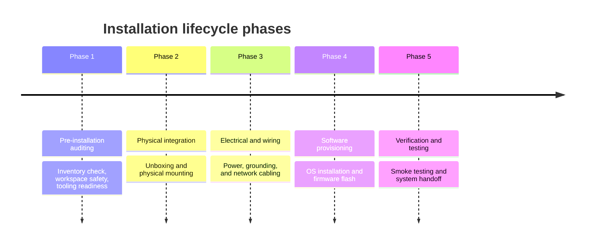

# Hardware and software installation manuals

> *Creating clear, high-stakes setup instructions for physical hardware or complex systems*

---

Documenting the installation of physical hardware and complex software systems requires a careful balance of safety guidelines and digital configurations. Unlike simple software user guides, installation manuals for high-stakes enterprise systems such as rack-mounted server nodes, industrial IoT controllers, or medical devices carry significant real-world risks. 

A poorly written step can result in fried circuitry, structural damage, or severe physical injury. As a technical writer, your success lies in creating highly structured, sequential instruction sets that bridge the gap between physical tools and virtual command lines.

This guide outlines the structural methodologies, safety standards, and verification frameworks needed to write clear, high-stakes setup documentation.

---

## The installation lifecycle

An installation manual should never be presented as a single, continuous wall of steps. Instead, organize the process into discrete, chronological phases. This breakdown allows the user to verify their work at key milestones before proceeding to riskier phases.



---

## Phase 1: Pre-installation auditing

Before the user touches a tool or opens a terminal, they must verify their environment. Phase 1 acts as a gatekeeper, making sure all physical and logical dependencies are satisfied.

### Environmental and tooling requirements

- **Physical tooling:** List the exact tools required, such as a Phillips #2 screwdriver, an ESD wrist strap, or an RJ-45 crimper.
- **Power specifications:** Explicitly declare the electrical load limits. Use standard mathematical tolerances: 

$$\text{Voltage Requirement} = 220\text{ V} \pm 10\% \text{ AC, } 50\text{ Hz}$$

---

## Phase 2: Physical integration

When documenting physical installations, safety warnings must precede the action steps. If a warning is placed *after* a step, the user might read it only after they have already made an error.

### Standardized warning hierarchies

!!! warning "Heavy Equipment Lift Hazard"
    The server chassis weighs approximately 35 kg (+/- 2 kg). Do not attempt to mount the unit into a server rack alone. This procedure requires at least two people or an approved mechanical lift.

### Structuring physical step sequences

When writing physical instructions, use precise verbs and spatial references. Avoid vague phrases such as *"put the unit in the box."* Instead, use specific locations and components:

1.  Slide the outer rack-mount rails onto the server chassis until the locking tabs click.
2.  Align the chassis rails with the front vertical mounting posts of the server cabinet.
3.  Push the server forward into the rack cabinet until the safety retention latches engage on both sides.
4.  Secure the front ears of the server to the rack cabinet by using four M6 panel screws.

---

## Phase 3: Electrical and wiring

After the unit is mounted, the user must establish power and data connectivity. This phase involves high-risk electrical work and logical configuration.

!!! danger "Electrical Hazard: Shock Risk"
    Make sure the main power supply breaker is switched to **OFF** before connecting any terminal wiring block to the power supply unit (PSU). Use a calibrated multimeter to verify that the voltage is zero.

### Network prerequisites

State the required firewall ports and logical network access:

| Service / Port | Protocol | Direction | Purpose |
| :--- | :---: | :---: | :--- |
| **TCP 443** | HTTPS | Outbound | Firmware updates and telemetry |
| **TCP 22** | SSH | Inbound | Local system administration |
| **UDP 123** | NTP | Outbound | Network time synchronization |

---

## Phase 4: Software and firmware provisioning

After the physical hardware is securely mounted, grounded, and powered, the manual transitions to the software layers. Because users might use different host operating systems to provision the required hardware, use tabbed code views to display platform-specific commands.

=== "Linux (Ubuntu / Debian)"
    ```bash
    # Update local repository indexes
    sudo apt-get update && sudo apt-get install -y provision-tool
    
    # Initialize connection to target device over local subnet
    provision-tool --target 192.168.1.50 --firmware v3.4.1
    ```

=== "macOS"
    ```bash
    # Install provisioning tool using Homebrew
    brew install provision-tool
    
    # Initialize connection to target device over local subnet
    provision-tool --target 192.168.1.50 --firmware v3.4.1
    ```

=== "Windows PowerShell"
    ```powershell
    # Install the system provisioning package
    Install-Package -Name ProvisionTool
    
    # Initialize connection to target device over local subnet
    & provision-tool.exe --target 192.168.1.50 --firmware v3.4.1
    ```

---

## Phase 5: Post-installation verification

The final section of the manual must guide the user through verifying that the system is fully operational. This verification, or "smoke test," makes sure the handoff from the installer to the end user is successful.

??? note "Troubleshooting common installation failures"
    If the system fails to initialize during post-installation verification, run these diagnostic checks:

    - **Power cycle:** Verify the physical power status LED is solid green. If it is blinking amber, power-cycle the unit by removing the power cord for 30 seconds.
    - **Ping test:** Attempt to ping the device at its default local IP address:
      `#!bash ping 192.168.1.50`
    - **Status check:** If the ping is successful but the admin dashboard does not load, verify that the local controller service is running on port 8080.

### Installation acceptance sign-off

Create a task list of expected behaviors to serve as an official sign-off reference:

- [ ] Power LED is solid green.
- [ ] Network activity LEDs on the RJ-45 ports show active green or amber blinking.
- [ ] Local administration dashboard is accessible over HTTPS at the target IP address.
- [ ] The system firmware version is **v3.4.1** or higher.
- [ ] All diagnostic self-test codes return a status of `0` (Success).