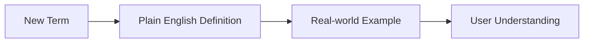

# Plain language (PL) standards
*A guide to eliminating jargon and using basic sentence structures for better comprehension*

---

Plain language (PL) is not about dumbing down technical content; it is about ensuring that your audience can *find what they need*, *understand what they find*, and *use what they find*. In technical writing, PL is a professional standard that prioritizes the user's time over the writer's ego.

---

## The accessibility connection

Plain language is the foundational layer of inclusive design. When you write simply, you remove barriers for three key groups:

- **Cognitive diversity:** Users with ADHD, dyslexia, or processing disorders benefit from clear, predictable sentence structures.
- **Situational disability:** Users under high stress (for example, a developer trying to fix a crashed server at 3 AM) have a significantly reduced cognitive budget for deciphering complex prose.
- **Assistive technology:** Screen readers handle simple sentences better than long, clause-heavy paragraphs.

!!! info "Inclusive by design"
    Writing in plain language verifies that your documentation site stays accessible to the widest possible audience, regardless of their native language or cognitive state.

---

## Vocabulary choice

Professional technical writing prioritizes familiarity over formality. Many writers mistakenly use complex synonyms to sound more authoritative, but this actually creates a barrier to understanding.

| Avoid (complex) | Use (simple) |
| :--- | :--- |
| Utilize | Use |
| Commence | Start |
| Terminate | Stop / end |
| Cognizant of | Aware of |
| In the event of | If |
| Disseminate | Share |

!!! tip "The utilize rule"
    If you can use the word "*use*," do not use "*utilize*." Simple verbs allow the reader to focus on the task rather than the vocabulary.

---

## Sentence architecture

High comprehension is directly linked to sentence length. As a rule of thumb, keep sentences under 20 to 25 words. 

A sentence that grows too long overwhelms the reader's working memory. To fix long sentences, look for conjunctions, such as and, but, or or, and see if you can split the sentence into two.

=== "Before (one long sentence)"
    "*Once you have completed the installation of the software and verified that your environment variables are set correctly, you should restart your terminal in order to ensure that all changes have been successfully applied to your system.*" (37 words)

=== "After (two short sentences)"
    "*Install the software and verify your environment variables. Then, restart your terminal to apply the changes.*" (16 words) [:lucide-check:](https://lucide.dev/){: target="_blank" rel="noopener" }

---

## Structural formatting (scannability)

Users rarely read documentation word-for-word; they scan it. If your page looks like a wall of text, users will likely leave the page. 

**Use these best practices to increase scannability:**

- **Descriptive headings:** Instead of "Introduction," use "How to install the SDK."
- **Bulleted lists:** Organize groups of related items or features.
- **Numbered lists:** Outline sequential steps that must be followed in order.
- **Bold text:** Highlight UI elements, button names, and keyboard shortcuts.

---

## Global readiness

Plain language is essential for global readiness. If you write documentation for an international audience, remember the following:

- **Translation costs:** Most translation services charge per word. Concise, plain language directly reduces the cost of localizing your documentation.
- **Non-native speakers:** Many users will read your English documentation as their second or third language. Avoid idioms (for example, "hit the ground running") and metaphors to verify they do not get lost in translation.

---

## The jargon filter

You cannot always avoid technical terms (jargon), but you must control how you introduce them. 

Use this process when a technical term is necessary:

1.  **Introduce:** Use the term.
2.  **Define:** Provide a brief, plain-English definition immediately.
3.  **Contextualize:** Show how the term is used in a real-world scenario.

---

## Testing for clarity

How do you know if your language is plain enough? Use objective testing methods:

- [**The cloze test**](../doc-lifecycle/usability-testing.md#the-cloze-test): Take a paragraph and remove every fifth word. Give it to a peer. If they can fill in the blanks with 60% accuracy, the context and language are clear.
- [**Readability scores**](../technical-writing/readability-scores.md): Use formulas such as [Flesch-Kincaid](https://en.wikipedia.org/wiki/Flesch%E2%80%93Kincaid_readability_tests){: target="_blank" rel="noopener" }. Aim for a grade level of eight to ten.
- [**Peer review**](../doc-lifecycle/review-approval.md): Ask a non-expert to read your draft. If they have to ask, "*What does this mean?*" regarding a specific word, you need to simplify that word.

!!! quote "The golden rule of plain language"
    "*Clear writing is a sign of clear thinking. If you cannot explain a concept simply, you likely do not understand it well enough yet.*"

---

## Summary checklist

- [ ] Is the average sentence length under 25 words?
- [ ] Did I replace "utilize" and "commence" with "use" and "start"?
- [ ] Are there idioms or metaphors that might confuse a non-native speaker?
- [ ] Does the page use headings and lists to break up large blocks of text?
- [ ] Are all necessary technical terms defined on their first use?