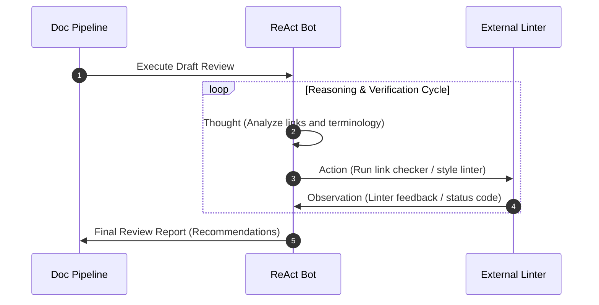

# Logic-based prompting patterns

> *Exploring zero-shot, few-shot, and logical reasoning patterns for AI-driven applications*

---

As generative artificial intelligence (AI) becomes deeply integrated into documentation tools and pipelines, [prompt engineering](../technical-writing/prompt-engineering.md) has emerged as a core competency for modern technical writers. You no longer just draft content; you design, refine, and maintain the prompt systems that automate drafting, linting, style compliance, and translation. 

To build reliable, reproducible, and accurate documentation assistants, you must move beyond conversational chatting and treat prompts as logical, structured instruction sets.

This guide explores how to design logic-based prompt patterns tailored specifically for technical writing workflows, ranging from simple zero-shot style checks to complex reasoning systems for raw code analysis.

---

## Direct inference patterns (zero-shot versus few-shot)

In documentation workflows, use direct inference to instantly transform, edit, or categorize content. The pattern you choose depends on whether the [large language model (LLM)](https://en.wikipedia.org/wiki/Large_language_model){: target="_blank" rel="noopener" } must follow standard linguistic rules (zero-shot) or mirror a highly specific organizational style (few-shot).

### Zero-shot prompting

Zero-shot prompting relies on the LLM’s built-in linguistic training. It is effective for automating standard editorial sweeps, such as converting passive voice to active voice, removing jargon, or running accessibility checks. To make zero-shot prompts deterministic, structure them with strict constraints and logical guardrails.

Zero-shot pattern:

```markdown
# System Prompt: Active voice editor
You are an automated editorial assistant enforcing Microsoft Writing Style Guide guidelines.

# Task:
Analyze the input text and rewrite any passive voice sentences into active voice.

# Constraints:
- Do not alter technical terms or code blocks.
- If a sentence is already in active voice, do not modify it.
- Output ONLY the revised markdown text. Do not include commentary.
```

### Few-shot prompting

Few-shot prompting uses in-context examples to teach the LLM a complex, custom, or undocumented style. Instead of describing a subtle brand voice with adjectives, provide concrete input-to-output pairs. 

For technical writers, this pattern is ideal for translating cryptic developer commit messages into polished, user-facing release notes:

Release notes few-shot pattern:

````markdown
Translate raw engineering commit logs into user-facing release notes. Use the specified JSON schema.

```json
Input: "fix: corrected auth middleware JWT token expiration check boundary error"
Output: {
  "type": "Bug Fix", 
  "component": "Authentication", 
  "description": "Resolved an issue where active user sessions were prematurely terminated due to an incorrect timestamp calculation."
}

Input: "feat: implemented support for bulk CSV import on backend team workspace"
Output: {
  "type": "New Feature", 
  "component": "Data Import", 
  "description": "Added the ability to import multiple user records simultaneously using standard CSV files."
}
```

Input: "fix: resolve memory leak in telemetry background reporter worker"  
Output: [model generates output using identical syntax and tone]
````

---

## Chain-of-thought for source analysis

Standard prompting asks an LLM to generate a direct mapping from a query to an answer ($Q \to A$). This direct approach often fails when you ask an LLM to explain a complex code block or git diff because it tries to write the explanation before fully analyzing the code path.

Chain-of-thought (CoT) prompting corrects this by forcing the LLM to generate intermediate logical reasoning steps ($C$) before writing the final draft. This can be modeled as:

$$ Q \to C_1 \to C_2 \to \dots \to C_n \to A $$

In this formula, $Q$ is the raw source file, $C_i$ represent logical breakdown steps, and $A$ is the final user-facing documentation.

Chain-of-thought pattern:

````markdown
# Chain-of-thought pattern: API endpoint analyst
Analyze the raw controller code and write a user-facing parameter reference.

Code: 

```javascript
app.post('/api/v1/deploy', (req, res) => {
  const force = req.body.forceDeploy === true;
  const timeout = parseInt(req.body.timeout, 10) || 30;
  if (timeout > 300) return res.status(400).send("Timeout exceeds limit");
  // deployment logic...
});
```

Reasoning step-by-step:

1. Identify the HTTP method and endpoint: POST `/api/v1/deploy`.
2. Analyze `forceDeploy`: It expects a boolean. It maps to `force` internally.
3. Analyze `timeout`: It parses an integer. It defaults to `30` if not provided.
4. Analyze constraints on `timeout`: It has a maximum limit of 300. 
   If exceeded, it returns a 400 Bad Request error.
5. Compile findings into a structured markdown table.

Final output:
[Model renders the clean Markdown table here based directly on the steps above]
````

---

## ReAct in documentation pipelines

The ReAct (Reasoning and Acting) pattern combines chain-of-thought thinking with external action. In technical documentation, this is the architecture behind advanced doc-linting bots. 

Instead of just checking spelling, a ReAct bot can reason about a documentation link, run an external link-checking tool, observe the response, and then determine if a warning is necessary.

The following process shows how a [documentation pipeline](../doc-stack/cicd.md#the-pipeline-concept) uses an intelligent feedback loop to analyze and lint drafts before delivering a final review report.



??? note "Click to see step-by-step flow"    
    1. **Triggering the review (step 1):** The Doc Pipeline initiates the process by sending an Execute Draft Review request to the ReAct Bot.
    2. **Reasoning and verification cycle (steps 2–4):** The ReAct Bot enters a continuous loop to evaluate the document:
        - **Thought (step 2):** The ReAct bot performs an internal analysis, evaluating the document's links and terminology.
        - **Action (step 3):** Based on its thoughts, the ReAct bot calls an External Linter to run active link checkers and style linters.
        - **Observation (step 4):** The External Linter returns feedback and status codes, which the ReAct bot observes to plan its next step or exit the loop.
    3. **Reporting (step 5):** Once the verification cycle is complete, the ReAct Bot sends a Final Review Report containing its recommendations back to the Doc Pipeline.

### ReAct bot configuration

To configure a ReAct bot within a documentation pipeline, the system prompt must explicitly define the tools available to the LLM and the strict execution sequence it must follow:

```markdown
# ReAct prompt: Technical accuracy agent

You are reviewing a draft for technical accuracy. You have access to this tool:

- VerifyAPIEndpoint[path]: Queries the live API gateway to check if an endpoint path exists.

Use this sequence:

Thought: Analyze if a path mentioned in the draft needs validation.
Action: Run VerifyAPIEndpoint[path] (use only this tool).
Observation: The output returned from the API gateway.
... (Repeat Thought/Action/Observation if multiple endpoints exist)
Thought: I have verified all paths.
Final Draft: The revised text with corrected paths.

Draft to Review: "To authenticate, send a POST request to `/api/v2/auth/login`."
```

---

## Output schemas for front matter automation

One of the most tedious tasks in managing a large static site is ensuring that metadata, taxonomy tags, and YAML [front matter](../doc-stack/metadata-frontmatter.md#what-is-frontmatter) are formatted correctly. You can use schema-enforced prompting to analyze a draft and automatically output syntactically correct metadata.

By writing a prompt that enforces a JSON schema, you can ensure the generated output directly integrates into automated front matter parsers without causing build failures.

````markdown
# Schema-enforced metadata pattern
Analyze the following draft article and generate a valid YAML front matter block.

Your output must strictly conform to this JSON schema:

```json
{
  "type": "object",
  "properties": {
    "title": {"type": "string"},
    "description": {"type": "string", "maxLength": 160},
    "tags": {
      "type": "array",
      "items": {"type": "string"}
    }
  },
  "required": ["title", "description", "tags"]
}
```

Draft:
"This guide covers how to set up Webhooks on your platform. Webhooks allow your  
system to receive real-time notifications about account changes. To begin,  
navigate to the developer dashboard and select **Create Webhook**..."
````

---

## Logic-based prompting cheat sheet

| Prompt pattern | Documentation use case | Complexity | Benefit |
| :--- | :--- | :---: | :--- |
| **Zero-shot** | Style guide linting, active voice correction | Low | Quick, automated editorial passes |
| **Few-shot** | Developer notes to release notes translation | Medium | Enforces strict, consistent voice and tone |
| **Chain-of-thought** | Documenting code, explaining complex logic | High | Prevents hallucinated steps in code guides |
| **ReAct** | Doc-bot validations, link and terminology checks | High | Combines logical reasoning with automated linting tools |
| **Enforced schema** | Generating YAML front matter or metadata | Medium | Ensures structured JSON/YAML won't break SSG builds |