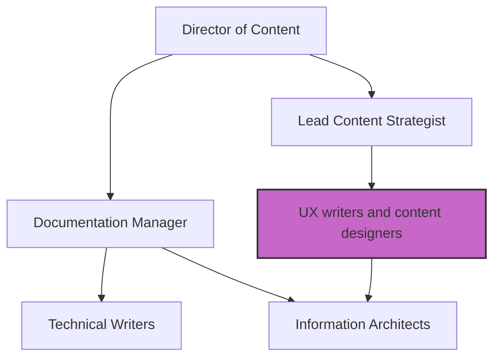

# Taxonomy of technical communication roles
*Explaining the different titles and responsibilities from technical writer to content strategist*

---

The technical communication profession has expanded far beyond the traditional *technical writer* title. As digital products have become more complex, the work required to explain them has fragmented into specialized roles that focus on different parts of the user experience, information structure, and business strategy.

---

## Professional foundations

The definitions of technical communication roles are not arbitrary; they are shaped by global professional organizations that establish the pedagogical and ethical standards for the field.

- **[Association of Teachers of Technical Writing (ATTW)](https://attw.org/){: target="_blank" rel="noopener" }:** This organization bridges the gap between academic research and professional practice, ensuring that the next generation of writers is trained in rhetorically sound and evidence-based communication.
- **[Australian Society for Technical Communication (ASTC)](https://astc.org.au/){: target="_blank" rel="noopener" }:** The ASTC provides a platform for certification, professional networking, and the standardization of competencies across the Asia-Pacific region and beyond.

These organizations help ensure that whether a professional is called a *documenter* or a *content designer*, they adhere to a shared set of ethics and quality standards.

---

## Technical writer

The technical writer remains the anchor of the profession. This role focuses on the end-to-end production of long-form documentation, including user manuals, installation guides, and API references.

- **Core focus:** This role emphasizes research, interviews with subject matter experts (SMEs), and content drafting.
- **Key skills:** Technical writers demonstrate mastery of complex technical subjects and explain them to a defined audience.
- **Primary output:** These professionals produce help centers, PDFs, and integrated help files.

---

## Content designer or UX writer

While the technical writer handles the manual, the content designer (often called a UX writer) handles the interface. They focus on the user's journey within the application itself.

- **Core focus:** This role prioritizes microcopy, such as button labels, error messages, and tooltips.
- **Key skills:** Content designers use empathy and brevity to collaborate with UI and UX designers in tools such as [Figma](https://www.figma.com/){: target="_blank" rel="noopener" }.
- **Primary output:** The process creates in-app text that guides users through frictionless workflows.

---

## Information architect

The information architect (IA) is the librarian of the documentation site. As a knowledge base grows from 50 pages to 5,000, the IA becomes crucial to ensure that users can find what they need.

- **Core focus:** This role organizes navigation hierarchy, taxonomy, and metadata.
- **Key skills:** Information architects must understand search algorithms, categorization logic, and user mental models.
- **Primary output:** Deliverables include sitemaps, faceted search filters, and tagging schemas.

---

## Content strategist

The content strategist takes a broad view of the [documentation lifecycle](../doc-lifecycle/ddlc.md). They treat content as a business asset that must be governed, measured, and funded.

- **The statement of work (SOW):** Content strategists often define the SOW, which is a formal document that outlines project scope, deliverables, and timelines. This approach prevents *scope creep* and verifies that resources are correctly allocated.
- **Core focus:** This role emphasizes governance, lifecycle management, and content return on investment (ROI).
- **Key skills:** Strategic positions require expertise in data analysis, project management, and business communication.

---

## Documentation manager

The documentation manager is a leadership role focused on people, process, and advocacy. They protect the writing team from burnout and represent the value of documentation to executive leadership.

- **Project management:** Documentation managers often adopt [Project Management Professional (PMP)](https://www.pmi.org/certifications/project-management-pmp){: target="_blank" rel="noopener" } principles. They use standardized methodologies to track velocity, manage *content debt*, and verify that documentation releases align with software shipping dates.
- **Core focus:** This role emphasizes resource allocation, team growth, and cross-departmental advocacy.

---

## Hybrid roles

In many modern tech companies, especially startups, technical communication overlaps with other disciplines.

- **Developer relations (DevRel):** A hybrid of technical writing and community management. DevRel professionals write sample code and tutorials while engaging with developers on forums and at conferences.
- **Product management:** Many technical writers transition into product management because their deep knowledge of user difficulties allows them to design better features.

---

## Role responsibility matrix

Use this matrix to understand the primary owner of different documentation tasks within a large organization.

| Task | Primary owner | Collaborators |
| :--- | :--- | :--- |
| **Drafting a new API reference** | Technical writer | Developer and SME |
| **Writing an error message** | Content designer | UI designer and engineer |
| **Designing the help center sidebar** | Information architect | Product manager |
| **Defining the content budget** | Content strategist | Documentation manager |
| **Handling a support-to-documentation escalation** | Documentation manager | Support lead |
| **Creating a "Getting Started" video** | Hybrid role (DevRel) | Marketing and writing |
| **Establishing the SOW for a vendor** | Content strategist | Legal and finance |

