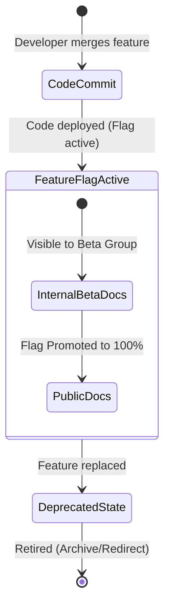

# High-growth SaaS environments

> *Understanding software as a service (SaaS) environments and rapid versioning cultures*

---

In a rapid-growth SaaS environment, change is the only constant. Unlike traditional software industries that relied on quarterly or annual release cycles, modern SaaS environments deploy code many times a day. This velocity has changed the traditional "write the manual after it’s built" documentation paradigm.

As a technical writer, surviving and thriving in a SaaS culture requires moving away from static publishing models. You must embrace [continuous integration](../doc-stack/cicd.md), [agile alignment](../doc-lifecycle/agile-workflows.md), and [progressive documentation](../technical-writing/saas-environments.md#progressive-documentation) strategies.

---

## The continuous delivery pipeline

In a continuous delivery (CD) pipeline, software is continuously built, tested, and released to production. You must integrate documentation directly into this automated pipeline.

Instead of treating the documentation site as a separate project, manage SaaS documentation as a code asset ([Docs as Code](../doc-stack/docs-as-code.md)) inside the same [version control repositories](../doc-stack/git.md) as the application code.

This ensures that when a developer pushes a new API endpoint or UI change, the corresponding documentation update travels through the same automated testing, approval, and deployment gates as the software itself.



??? note "Click to expand technical details"
    This Mermaid diagram illustrates the lifecycle of documentation within a continuous delivery (CD) pipeline, specifically focusing on how feature flags control the visibility of content.

    The process consists of the following stages:

    1.  **Initiation (CodeCommit):** The workflow begins when a developer merges a new feature into the version control repository. 
    2.  **Deployment (FeatureFlagActive):** The code is deployed to the production environment, but its visibility is controlled by a feature flag. This stage contains two sub-stages for documentation:
        - **Internal or beta documentation (InternalBetaDocs):** Initially, documentation is visible only to a specific beta group or internal stakeholders while the feature is in limited rollout.
        - **Public documentation (PublicDocs):** Once the feature flag is promoted (rolled out to 100% of the user base), the documentation is moved to the public-facing site.
    3.  **Deprecation (DeprecatedState):** When the feature is eventually replaced by a newer version or a different service, the state changes to a deprecated state. In this stage, the documentation typically includes warning labels or "sunset" notices.
    4.  **Retirement (Retired (Archive/Redirect)):** The lifecycle ends when the feature is fully retired. At this point, the documentation is either archived or removed, and permanent redirects are configured to point users toward updated resources.

---

## Progressive documentation

One of the greatest challenges in SaaS technical writing is documenting features that are not yet visible to all users. SaaS engineering teams frequently use feature flags (or toggle states) to deploy code in a dormant state or run progressive rollouts. For example, a team might first release a feature to only 10% of users.

If you publish documentation for a flagged feature too early, you might confuse the 90% of users who cannot access it. If you publish the documentation too late, you leave the 10% of beta users without help.

To handle this discrepancy, use two main progressive documentation strategies:

1.   **Targeted dynamic content:** If your documentation platform supports it, use metadata or front matter tags to show or hide documentation sections dynamically based on the user's logged-in status or permission group.
2.   **The beta admonition pattern:** If dynamic rendering is not possible, publish the documentation globally, but use a distinct notice banner to set clear expectations.

```markdown
!!! info "Beta feature"
    The bulk export system is currently in progressive rollout and is available 
    only to enterprise workspaces. To request early access, contact your account manager.
```

---

## Managing semantic versioning and API deprecations

SaaS platforms evolve continuously. For this reason, managing versioning without confusing your developer community is a critical balancing act. Most modern SaaS APIs rely on semantic versioning (SemVer), structured as `MAJOR.MINOR.PATCH`.

```
Given a version number MAJOR.MINOR.PATCH, increment the:
- MAJOR version when you make incompatible API changes (Breaking)
- MINOR version when you add functionality in a backward-compatible manner
- PATCH version when you make backward-compatible bug fixes
```

### Deprecation workflow

When an API endpoint or platform feature is retired in a SaaS environment, the technical writer is responsible for coordinating the communication to prevent developer churn (loss of developers who use the platform, API, or software tools).

```markdown
!!! danger "Deprecation notice"
    The `/v1/users/export` endpoint is deprecated and will be fully retired on 
    December 31, 2026. Transition your applications to `/v2/data/export` as 
    soon as possible to prevent service interruption.
```

To execute a clean deprecation, follow these steps:

1.  **Introduce and warn:** Mark the old functionality as deprecated in the documentation and add warning labels directly to the API reference pages.
2.  **Monitor usage:** Work with product managers to track traffic dropping on the deprecated resource.
3.  **Hard stop:** Once usage falls below a safe threshold, remove the documentation page and configure a permanent 301 redirect to the newer version to prevent broken links.

---

## Release notes as a growth tool

In SaaS environments, release notes are more than a dry compliance requirement; they are a vital touchpoint for customer retention and marketing. A successful SaaS release notes strategy balances the needs of three distinct audiences:

| Target audience | What they care about | Documentation strategy |
| :--- | :--- | :--- |
| **Developers and system administrators** | Breaking changes, API parameters, and back-end fixes. | Provide precise code blocks and strict version details, and link to API references. |
| **Product managers and sales** | Brand growth, new feature adoption, and value propositions. | Use high-level, benefits-oriented language and visual walkthroughs. |
| **End users and customers** | Daily workflows, UI changes, and bug fixes. | Focus on task-oriented explanations ("How this helps you"). |

To satisfy all three, organize your release notes feed with filterable tags, such as `[Fixed]`, `[Added]`, `[Security]`, or `[Breaking]`. This allows developers to scan for system risks while business users can scan for new workflows.

---

## Continuous SaaS content audits

The highest risk in high-growth SaaS environments is content rot (documentation is neglected). Since features are updated, renamed, and retired quickly, documentation can become inaccurate in weeks.

???+ note "Automating content rot detection"
    To combat content rot without reading every page manually, use automated scripts and data tracking:
    
    -   **Freshness alerts:** Set up automated triggers in your repository to flag any Markdown file that has not been edited or reviewed in more than six months.
    -   **Error log tracking:** Monitor search analytics to identify search queries that yield zero results or have high exit rates, which indicates a content gap.
    -   **Direct feedback widgets:** Include a simple "Was this page helpful?" widget at the bottom of every page to let users flag stale instructions.