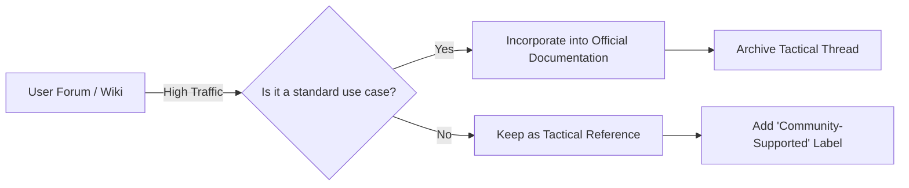

# Tactical technical communication practices

> *Understanding do-it-yourself (DIY) knowledge sharing and community-driven documentation cultures such as wikis and forums*

---

While strategic [technical communication](../technical-writing/basics.md) focuses on centralized, top-down authority and highly governed release cycles, tactical technical communication (TTC) operates in the wild. It is defined by agility, community-driven contributions, and bottom-up knowledge sharing. 

In many fast-moving engineering cultures, the most current information lives in a wiki, a pinned forum post, or a collaborative [GitHub Discussions](https://github.com/features/discussions){: target="_blank" rel="noopener" } thread instead of the official manual. For modern technical writers, working effectively in these tactical spaces means learning how to curate, validate, and use informal knowledge without slowing down the community.

---

## The landscape of tactical knowledge

Tactical technical communication thrives where formal documentation fails to keep pace with rapid software changes or niche user edge cases. These fast-moving cultures prioritize immediate problem-solving over editorial perfection.

=== "Community wikis"
    - **Characteristics:** Highly collaborative, version-controlled, and perpetually in draft mode.
    - **Value:** Excellent for capturing institutional knowledge and long-tail technical details that are too granular for official guides.
    - **Challenge:** Stale content and lack of a unified voice can lead to confusing or conflicting instructions.

=== "Developer forums"
    - **Characteristics:** Conversational, searchable, and thread-based.
    - **Value:** Real-world troubleshooting. Users often document workarounds for bugs before the engineering team can issue a fix.
    - **Challenge:** Signal-to-noise ratio. Critical information is often buried under pages of conversation.

=== "Social documentation"
    - **Characteristics:** Platforms such as [Stack Overflow](https://stackoverflow.com){: target="_blank" rel="noopener" }, [Reddit](https://www.reddit.com){: target="_blank" rel="noopener" }, or [Discord](https://discord.com){: target="_blank" rel="noopener" }.
    - **Value:** Instant feedback loops and high visibility.
    - **Challenge:** No control over the platform's lifecycle or data ownership.

---

## Curating informal knowledge

In community-driven environments, the technical writer’s role shifts from primary author to knowledge curator. Instead of writing every word, you establish the frameworks that allow others to write effectively.

### High-signal curation strategies

To prevent a community wiki or forum from becoming a data graveyard, technical writers implement lightweight governance structures:

1.  **Templates for emergent knowledge:** Provide stubs or basic Markdown templates for new wiki entries to make sure contributors include vital metadata (for example, *Affected version*, *Prerequisites*, and *Author*).
2.  **The "verified" badge:** In forums or Discord channels, implement a system to tag or pin solutions that the product team has technically validated.
3.  **Active pruning:** Regularly archive threads or wiki pages that are no longer accurate because of product deprecations.

??? note "Anatomy of a tactical wiki page"
    A successful community-driven page should prioritize scannability over prose.
    
    - **Summary box:** What problem does this solve?
    - **Status:** Draft, Verified, or Legacy.
    - **Fix:** Bulleted steps or a single code snippet.
    - **Context:** Link to the official documentation for the broader feature.

---

## From tactical to strategic

The goal of monitoring tactical spaces is to identify content that is mature enough to move into the official documentation set. This process is known as knowledge harvesting.

### Knowledge harvesting workflow

When you notice a specific forum thread or wiki page receiving high traffic or frequent internal references, use this workflow:

- [ ] **Verify accuracy:** Test the community-provided solution against the current build.
- [ ] **Generalize the language:** Remove conversation-specific context (for example, *"I tried this and it worked for me"*) and replace it with objective technical instructions.
- [ ] **Apply style standards:** Align the community content with your organization’s voice, tone, and formatting rules.
- [ ] **Cross-link:** Add a link in the official documentation back to the original community thread to acknowledge the source and provide space for further discussion.

---

## Community-driven documentation metrics

Community-driven documentation uses different key performance indicators (KPIs) than traditional documentation. To measure success, track metrics that focus on community health, responsiveness, and problem-solving efficiency.

| Metric | What it measures | Tactical value |
| :--- | :--- | :--- |
| **Time to solution** | Average time from a question being posted to a verified answer | Measures community health and responsiveness |
| **Deflection rate** | Number of users who visited a wiki or forum instead of opening a support ticket | Proves the [return on investment (ROI)](../doc-lifecycle/roi.md) of maintaining a community space |
| **Contribution velocity** | Frequency of edits by non-documentation staff | Indicates how well engineers and users adopt the DIY culture |

---

## Best practices for technical writers

!!! tip "Embrace the mess"
    Do not try to force a community wiki to look like a polished manual. If you make the barriers to entry too high (for example, strict grammar checks), people will stop contributing. Focus on accuracy and [findability](../doc-stack/kb-architecture.md#findability-and-internal-linking) first.

!!! warning "Watch for silos"
    Community-driven documentation can easily become "shadow docs" (information that exists only in a Slack channel or a private wiki). Always advocate for moving critical information into a searchable, public-facing, or company-wide accessible format.

- **Encourage public learning:** When an engineer explains something to you in private, ask them to post it in the public forum or wiki so you can help them polish it later.
- **Use low-friction tools:** If your community uses Markdown in [GitHub](https://github.com){: target="_blank" rel="noopener" }, do not force them to use a complex content management system for documentation. Meet them where they already work.
- **Acknowledge contributors:** Community-driven documentation is fueled by helpfulness and recognition. Make sure top contributors are recognized in the community or within the company.