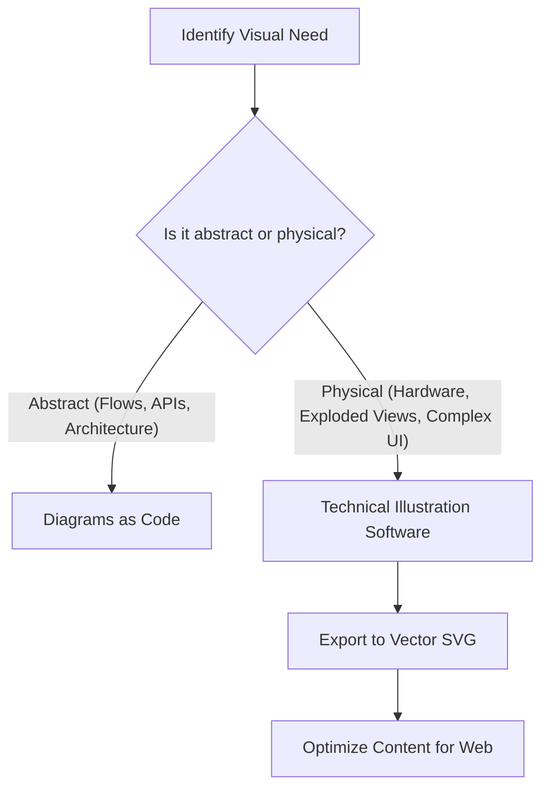

# Technical illustration software

> *Creating high-fidelity, complex visual assets to bridge the gap between physical reality and technical documentation.*

---

While code-based diagrams are efficient for logical flows and system architectures, complex physical systems, hardware assemblies, and consumer-facing interfaces require high-fidelity technical illustration software.

This guide covers the methodologies, standards, and optimization workflows for using professional technical illustration software in modern [technical communication](../technical-writing/basics.md) pipelines.

---

## Why use technical illustration software?

Choosing how to represent information visually is a strategic decision. While you can quickly generate simple flowcharts using text-based scripts, complex visual tasks require dedicated vector design environments. These design environments allow you to create high-precision, infinitely scalable assets, which is vital in the hardware, industrial manufacturing, and medical technology sectors.

The following flowchart outlines the decision-making process for selecting a visual representation based on the nature of your content. Use a [Diagrams as Code (DaC)](../doc-stack/diagrams-as-code.md) workflow for abstract concepts, such as system architectures and API flows. For physical hardware, exploded views, or detailed interfaces, use technical illustration software to create and optimize high-fidelity vector assets.



### High-fidelity use cases

High-fidelity illustrations provide the visual detail necessary to explain complex physical systems and precise digital interactions. While abstract diagrams show how data flows, these use cases focus on representing objects exactly as they appear in the real world or in a user interface. Use technical illustration software for the following scenarios to ensure accuracy and clarity for your audience.

- **Exploded views:** These show how physical hardware components fit together, often directly mapped to a [bill of materials (BOM)](../technical-writing/basics.md#types-of-deliverables).
- **Isometric schematics:** These are used for complex network appliances, smart home hardware, or Internet of Things (IoT) ecosystems where depth is required.
- **Micro-interactions:** These include pixel-perfect user interface (UI) illustrations, icons, and micro-animations for high-fidelity user guides.

---

## Technical illustration file formats

Before you explore illustration software workflows, you must understand the mathematical difference between the two primary formats you will export: vector and raster.

=== "Vector formats (SVG, EPS)"
    - **How they work:** Vector images use mathematical formulas (points, paths, curves, and shapes) to draw an image.
    - **Best use:** Use for diagrams, icons, technical schematics, and line drawings.
    - **Advantages:** They are infinitely scalable without losing resolution and have small file sizes.
    - **Integration:** You can style them directly in your documentation using CSS or manipulate them with JavaScript.

=== "Raster formats (PNG, WebP)"
    - **How they work:** Raster images consist of a static grid of colored pixels.
    - **Best use:** Use for highly detailed screenshots, photographs, or complex texture-heavy renderings.
    - **Advantages:** They display complex color transitions and photographic details effectively.
    - **Disadvantages:** They pixelate when scaled up. Large file sizes can slow down documentation load times.

---

## Vector design workflow

Whether your organization uses open-source design platforms or proprietary creative suites, the workflow for technical illustration should remain structured. To keep your source files maintainable for other writers, follow these standards:

### 1. Structural layering

Always organize your illustration into distinct, labeled layers. If another writer needs to modify an image later, they should not have to search through a single flattened group.

- **Annotations layer:** Contains text callouts, dimensions, and pointer arrows. Keep this at the top.
- **Foreground elements:** Contains the primary components, line work, and shading.
- **Background grid and guides:** Contains structural reference lines that remain hidden during final export.

### 2. Standardized color palettes

Create and lock a globally shared color palette within your illustration software. 

- **Use consistent colors for structural components**. For example, make all screws medium gray and all input ports solid blue.
- **Ensure your background colors are transparent**. This way, the illustration looks correct in both light and dark modes on your documentation site.

### 3. Precision grid alignment

Enable the pixel grid, such as an 8-px or 4-px grid, inside your illustration software. Aligning your paths directly to grid intersections prevents the "anti-aliasing blur" that occurs when an exported Scalable Vector Graphics (SVG) renders on a fractional pixel, such as `#!css x="12.4px"`.

---

## Optimizing SVGs for modern documentation

Technical illustration software often exports files with unnecessary metadata, editor-specific tags, and unused color profiles. Before committing an asset to your repository, clean up the code.

???+ note "Advanced SVG optimization steps"
    If you open an exported .svg file in a text editor, you will likely see many lines of unnecessary code. You can use command-line automated optimization tools or manual cleanup to shrink the file size by up to 70%.
    
    1. **Remove namespaces:** Strip out editor tags such as `xmlns:odm` or `sodipodi:docname`.
    2. **Convert shapes to paths:** Converting basic circles and rectangles into vector paths (`#!xml <path d="..." />`) reduces rendering complexity.
    3. **Minify code:** Remove line breaks, spaces, and formatting to create a single lightweight string.
    
    This is especially important if you are integrating illustrations into automated, machine-readable pipelines where files are fetched or rendered dynamically.

```markdown
{: .caption }
*Figure 1: High-fidelity hardware schematic with transparent background*
```

---

## Accessibility in technical illustrations

Illustrations communicate information quickly, but they are invisible to people with vision disabilities unless you account for them in your code.

!!! danger "Accessibility warning"
    Never rely on color alone to convey crucial technical information, such as warning steps. Always support color choices with text annotations or patterns, and ensure your HTML output includes descriptive `alt` tags.

```markdown
# Detail the image contents for screen readers

```

In addition to descriptive alternative text, you can use embedded accessibility tags directly inside the SVG's XML layout:

```xml
<svg role="img" aria-labelledby="svg-title svg-desc" ...>
  <title id="svg-title">IoT Hub Outer Assembly</title>
  <desc id="svg-desc">Exploded line drawing showing the front cover separating from the primary PCB chassis.</desc>
  <!-- Vector paths go here -->
</svg>
```

---

## Summary checklist

Keep this checklist handy when working inside your technical illustration software:

- [ ] Set the document coordinate system to pixels rather than inches or millimeters.
- [ ] Convert all text elements to outlines to prevent font rendering errors.
- [ ] Match the color palette to your company's official brand guide.
- [ ] Name and organize all layers properly.
- [ ] Test how the illustration renders on a dark background.
- [ ] Run the exported vector file through an SVG optimizer.