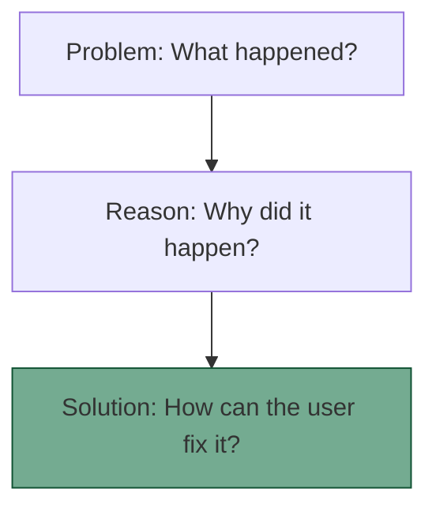

# UX writing and microcopy
*Best practices for crafting error messages, button labels, and tooltips within software interfaces*

---

UX writing is the practice of crafting the text users encounter as they use a digital product. Unlike long-form documentation, microcopy (small snippets of text such as button labels, error messages, and tooltips) must be functional, contextual, and extremely brief. 

The goal of UX writing is to reduce friction and guide the user through a task without the user realizing they are being guided.

---

## Writing for UI components

Every element in a user interface (UI) should have a clear, actionable label. Ambiguous labels lead to *click hesitation* (a user stops to wonder what will happen if they proceed).

- **Button labels:** Always start with a specific verb. Instead of **Submit** or **OK**, use **Save changes**, **Create account**, or **Delete project**.
- **Menu items:** Use nouns that reflect the user's mental model (for example, **Settings** instead of **General preferences**).
- **Checkboxes and toggles:** Labels should clearly describe the "on" state. 
    - *Bad:* "*Do you not want to receive emails?*" 
    - *Good:* "*Send me weekly updates.*"

---

## Anatomy of an error message

A poor error message, such as **Error 404** or **System failure**, leaves a user stranded. A professional error message follows the problem, reason, and solution framework.



**Example:**

- **Bad:** "*Invalid input.*"
- **Better:** "*Cannot save password (P). Your password must be at least 8 characters long (R). Please add more characters and try again (S).*"

---

## Onboarding and tooltips

Tooltips provide contextual help or information that appears exactly when and where a user needs it. 

- **Micro-moments:** Use tooltips for high-risk actions or complex features. 
- **Non-intrusive flow:** Do not use tooltips to explain the obvious. If a button says **Search**, you do not need a tooltip that says "*Click here to search.*"
- **Brevity:** Keep tooltip text under 15 to 20 words. If the explanation requires additional words, link to a full [quick start guide](../references/templates.md#quick-start-guide).

---

## Consistency and the string glossary

In a codebase, UI text is often referred to as a *string*. To prevent confusion, the same action must have the same name throughout the entire application.

| Action | Standard term | Avoid |
| :--- | :--- | :--- |
| Removing an item | **Delete** | Remove, Trash, Erase |
| Changing info | **Edit** | Modify, Change, Update |
| Going back | **Cancel** | Quit, Exit, Stop |
| Moving forward | **Next** | Continue, Proceed, Go |

!!! tip "Centralized naming"
    Create a UI string glossary shared between technical writers, designers, and developers to ensure that **Delete** never accidentally becomes **Trash** in a submenu.

---

## Tone of voice in interfaces

While technical writing is usually objective, microcopy allows for more personality, provided it does not sacrifice clarity.

- **Success states:** You can be more celebratory when a user finishes a task ("*Great job! Your profile is 100% complete.*").
- **Error states:** Be humble and helpful. Never blame the user (Avoid "*You entered the wrong date.*").
- **Crisis states:** If a system is down or data is lost, drop all humor and brand personality. Be direct, serious, and informative.

---

## Transactional content

Transactional content includes the emails and banners that trigger based on user actions.

- **Subject lines:** Subject lines must be functional. "*Action Required: Verify your email*" is better than "*Welcome to the family!*"
- **Success banners:** Use toast notifications (small pop-ups that disappear) for low-stakes actions such as "*Message sent.*" Use persistent banners for high-stakes information such as "*Subscription expiring.*"

---

## The developer handoff

In modern software development, technical writers often manage microcopy directly in the code using [JSON](https://www.json.org/){: target="_blank" rel="noopener" } files or string IDs to ensure that text is decoupled from the UI logic. This makes it easier to update or localize into other languages.

```json
{
  "login_screen": {
    "header": "Welcome back",
    "cta_button": "Log in",
    "error_auth_failed": "Incorrect username or password. Please try again."
  }
}
```

!!! note "Localization (L10n)"
    By using string IDs such as `cta_button`, a developer can swap the English JSON file for a Spanish JSON file without changing a single line of application code.

---

## The microcopy pattern library

When designing UI text, refer to these four patterns to ensure your microcopy is helpful and professional.

### 1. The empty state
- **When:** The user does not have data yet (for example, an empty inbox).
- **Goal:** Tell them what the feature does and how to get started.
- **Pattern:** `[Icon]` + `[Value proposition]` + `[Call to action]`.

### 2. The confirmation dialog
- **When:** A user takes a high-risk action (for example, deleting a database).
- **Goal:** Prevent accidental data loss.
- **Pattern:** `[Clear question]` + `[Consequence]` + `[Distinct action buttons]`.

### 3. The loading state
- **When:** The system is processing.
- **Goal:** Reduce perceived wait time.
- **Pattern:** Use active verbs (for example, "*Fetching your results...*") rather than just "*Loading...*."

### 4. The permissions request
- **When:** The app needs access to a camera or location.
- **Goal:** Build trust.
- **Pattern:** `[Benefit of access]` + `[Specific request]`. Example: "*Allow access to your camera so you can take a profile photo.*"