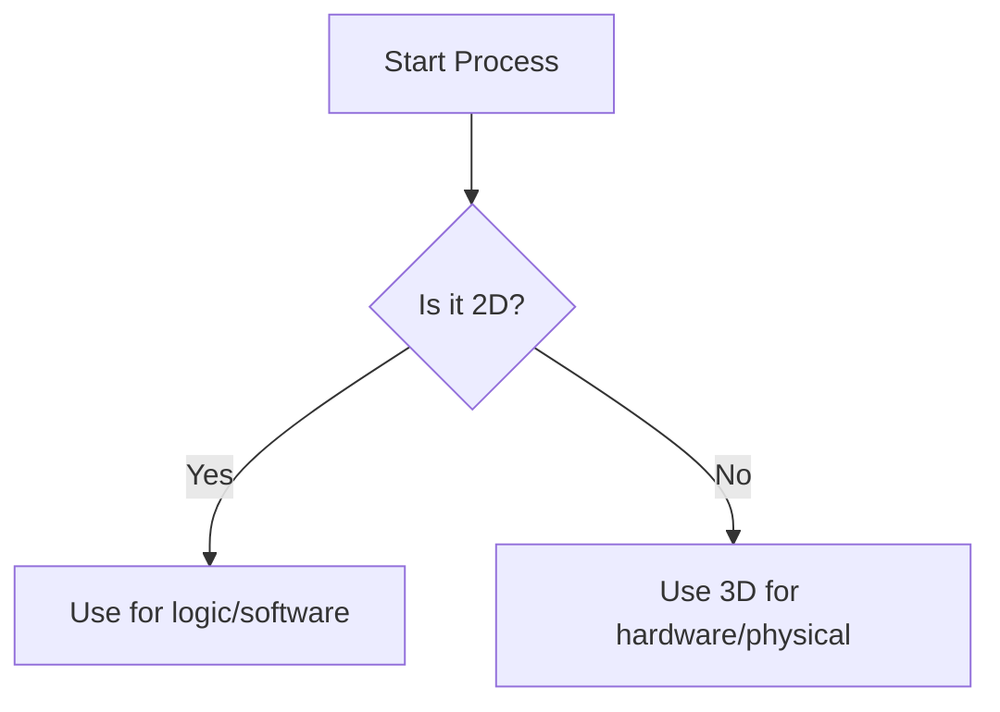

# Visual communication principles
*How to use layout, white space, and visual cues to simplify dense technical information*

---

In technical documentation, visual communication is not an aesthetic luxury; it is a functional necessity. Research into [cognitive load](../technical-writing/cognitive-load.md) suggests that users process visual information up to 60,000 times faster than text. 

By applying fundamental design principles, technical writers can break down walls of text, reduce reader fatigue, and clarify complex relationships that prose alone cannot describe.

---

## The role of white space

White space (or negative space) is the unmarked area between paragraphs, images, and margins. Its primary function is to provide the reader's brain with breathing room, allowing for better information grouping and focus.

- **Separation of ideas:** Use ample white space to signal the transition from one concept to another.
- **Reduced visual fatigue:** Dense blocks of text appear intimidating and cause readers to skim or abandon the page.
- **The proximity principle:** Elements placed close together are perceived as related. Use white space to group a caption with its image or a step with its specific screenshot.

---

## Typography and legibility

Typography in technical writing is about *legibility* (how easy it is to distinguish individual letters) and *readability* (how easy it is to scan a block of text).

- **Leading (line spacing):** This refers to the vertical space between lines of text. For technical content, leading of 1.4 to 1.6 times the font size prevents lines from blurring together.
- **Kerning (letter spacing):** This involves adjusting the space between individual characters. Most modern fonts handle this automatically, but for large headings, verify that letters do not touch.
- **Justification:** Technical documentation requires left-aligned (ragged right) text. Justified text creates *rivers of white* and uneven spacing that disrupts the reader's eye tracking.

---

## The screenshot etiquette

Screenshots are high-value assets that can quickly become visual noise if they are not managed correctly.

- **Aggressive cropping:** Do not capture the entire monitor. Crop only the specific UI element, dialog box, or button the user needs to see.
- **Annotation consistency:** Use a consistent color, such as bright red or high-contrast pink, for arrows and callout boxes. Avoid obscuring the text you are highlighting.
- **Resolution and scaling:** Ensure that images are high-resolution but optimized for the web. Avoid scaling up small images, as pixelation suggests a lack of professional quality.

---

## Diagramming basics: 2D versus 3D

Different types of information require different dimensional approaches.

- **Two-dimensional (2D) diagrams:** These are best for abstract logic, process flows, and software architecture. Flowcharts and sequence diagrams use standardized shapes to represent actions and decisions.
- **Three-dimensional (3D) renderings:** These are essential for hardware documentation, assembly instructions, and physical maintenance guides. 3D visuals help the user understand spatial relationships and orientation.

---

## Color theory in documentation

Use color semantically to convey meaning rather than just for aesthetic purposes.

- **Consistency:** Use a single color for **Success** (Green), **Warning** (Yellow/Orange), and **Danger/Error** (Red).
- **The "color-plus" rule:** Never rely on color alone to convey meaning. A user who is color-blind may not distinguish a red **Error** box from a green **Success** box. Always include an icon ([:lucide-circle-alert:](https://lucide.dev/){: target="_blank" rel="noopener" }) or clear text labels to accompany the color.

---

## Iconography and global communication

Icons act as a universal language, reducing the need for translated text and speeding up scanning.

- **Universal symbols:** Use standard icons such as a trash can for **Delete**, a magnifying glass for **Search**, or a disk symbol for **Save**.
- **Minimalist design:** Choose line art or flat icons over complex, realistic images. They are easier to recognize at small sizes and different screen resolutions.

---

## Alt text strategy for inclusive design

Visuals must be accessible to all users, including those who use screen readers. You can achieve this by using alt text.

- **Descriptive, not literal:** Instead of "*Diagram of a server*," use "*A flowchart showing how the client sends an encrypted request to the server*."
- **Function over form:** Describe what the visual *does* or *teaches*, rather than every aesthetic detail.
- **Null alt text:** If an image is purely decorative, such as a divider line, use an empty `alt` attribute (`alt=""`) so the screen reader ignores it.

---

## Design standards: visual quick reference

| Design element | Recommended standard | Why it matters |
| :--- | :--- | :--- |
| **Paragraph length** | Three to five lines maximum | Prevents wall-of-text fatigue |
| **Line height** | 1.5 | Improves tracking for dyslexic and low-vision users |
| **Alignment** | Left-aligned | Maintains consistent eye-tracking starting points |
| **Image formatting** | 2-pixel border around white images | Distinguishes the screenshot from the page background |
| **Typography** | Sans-serif for body text | Generally considered more legible for digital reading |
| **Diagrams** | [Vector (SVG)](https://www.w3.org/Graphics/SVG/){: target="_blank" rel="noopener" } where possible | Ensures visuals stay sharp at any zoom level |
| **Contrast ratio** | Minimum 4.5:1 | Essential for [WCAG 2.1](https://www.w3.org/WAI/standards-guidelines/wcag/){: target="_blank" rel="noopener" } accessibility compliance |